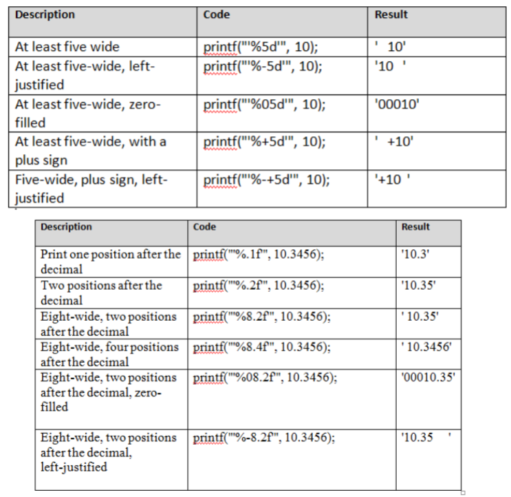

**Common IO functions**
printf()    Prints
scanf()     Scans (gets input)  
getchar()   Reads a single char
putchar()   Prints a single char
EOF         Error mentioning end of file (doesn't crash or throw exception)

**Arrays**
Store multiple of the same variable type
C code does NOT check array bounds
Array outside of function is always static 

**Pointers**
*&* Generates a pointer to x (gets the address of value)
* Dereferences a pointer (Gets the value of an address)
Ex: 
p = &c; //p is the address of c
*p = 10 //the address of p contains 10

Pointer is a variable that stores the address of another variable
int *p;
p = &x;
Can be used to access memory location or pass address to a function

type *type; //A pointer to whatever type

Can also have a pointer to a pointer **

C does not check if the pointer is valid
p++ will look at the next int
You can also do address math

**Arrays and pointers**
Arrays behave like pointers
A[10] is a pointer to A[0]
p = A; is legal
p will point to A[0] so *p will give you the element at A[0]
*(p+n) will give you the value at A[n]
p = &A[5]
is the same thing as 
p = A + 5
Both of these make p a pointer to the 5th element

double A[10] sets aside 10 blocks of memory (each large enough for one double)
double *A sets aside 1 pointer sized block of memory

int A[10]
int B[10]
A = B sets A to what B is pointing to. Old contents of A are now unreachable

void func(int a[])
is the same as 
void func(int* a)

Both of these functions are able to change the original value passed through instead of a copy

**CHECK**
while (*t++ = *s++)
This changes t to be the same as s
Whatever t is pointing to is whatever s is pointing to until they aren't pointing at anything

