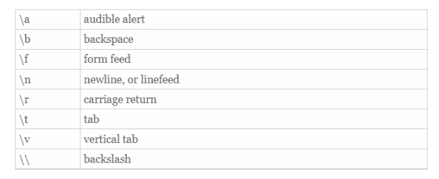

When using cpp, have a building block approach which means reuse code that already exists
In cpp, this includes classes and functions from
    * C++ Standard Library
    * developed by you or colleagues
    * Classes and functions from third-party libraries
Doing this can reduce development time since the already made functions are optimized and made

Compiled programs 
    Compiling takes a while
    Interpreters made to execute programs directly (no compilation) but with the cost of speed
        JS, Python, PHP

**Data:**

Bit: 1 or 0, most basic
Byte: 8 bits
Field: Set of characters (bytes) representing piece of data (Like a word in a line)
Record: Collection of related fields (like a line)
File: Collection of related record

**Concepts supported by OO**
Classes:
    - Attributes (vars) and methods (func)
    - Member function
    - Private, public, or protected
Encapsulation
    - Information hiding
Inheritance
    - Single/double
    - Facilitate reusability
Polymorphism

**C++**
Anything with # is a directive for the preprocessor
main() is a part of every c++ program, where execution starts
Input and output is from streams of characters
std::cout sends a stream of characters to standard output stream object (the screen)
    the std part means the cout function in std namespace

<< is the stream insertion operator multiple << is concatenation 

return 0 means exit safely, a safe exit is getting to the end of the program 

If statements require () around them
using namespace std removes the need for putting std:: prefix

Preincrement: ++i   Increase var by 1 and then use it
postincrement: i++  Use the var then increase by 1

**Control selection**
Sequential structure: Execute one instruction after another
Selection structure: Choice of statements selected to be executed (if/else and switch)
Repetition structure: Do something multiple times (or none) like while, do while, and for loops

For loops are counter controlled repetition structures while while loops sometimes are sometimes aren't
3 expressions are optional but the 2 semicolons are needed

do while executes once and then checks whether to do it again or not

Switch statements are kinda like ifelse blocks when trying to determine a specific value. Breaks needed or otherwise it will cascade down
If there is no match the default will occur

Break leaves the loop
Continue goes to the next loop right away