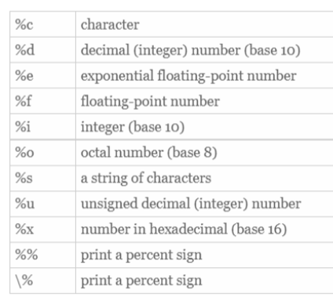

**STATIC** Global vars, can be accessed throughout program (no scope)
Static data is constant
    Static arrays 0s by default
Compiler turns into binary
Preprocessor expands code so that all the imported libraries are added and so that comments are removed 
Case matters but white space doesn't
{ 
    These mark blocks of code and can alter scope (vars declared here delete after done)

} 

to use libraries you have to import their header files

**Vars**
Float, int, char
String is an array
You have to declare a var before you use it

**operators**
There are many different operators (comparison operators result in 0 or 1)
if (operation) {
    Stuff
}

& is bitwise and but it can also be address of operator 
    It would get the address at where the var is located 
++i increments and then evaluates
i++ evaluates then increments
//suppose i is 5
y = ++i //y is 6 i is 6
y = i++ //y is 5 i is 6

**Scope**
Variables are only accessable directly when they are in the same scope{} otherwise they need pointers or references

**printf**
Is in the #include statement (aka headerfile)

%3d will right justify ints
%-3d will left justify ints
%03d will right justify and have leading 0s (001)

**Arrays**
put [size] after var name to declare an array with that size. 
Arrays of structs, unions, pointers, etc. allowed but it has to be same element
Can also declare a 2d array like this int[a][b] where a is rows and b is columns

*Have to be careful because if you do arr[val] where val>size, C will still try and access that number even though it is out of size*
You can index to access specific element

*automatic array*
int B[20] = {1, 2,3,4,5,6}
    The rest are 0s
int B[] = {1,2,3,4,5}
    AUtomatically makes array with 5 elements
int B[3] = {1,2,3,4}
    Error
sizeof returns # of bytes required

int[2][3] = {1, 2, 3, 4, 5, 6}
    OR
int[2][3] = {1, 2, 3}. {4, 5, 6}