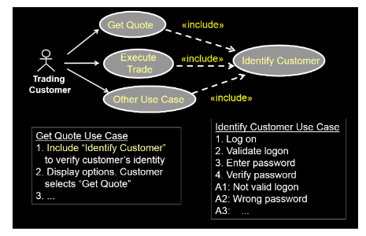
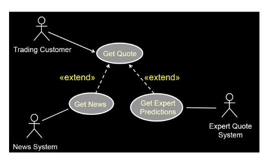
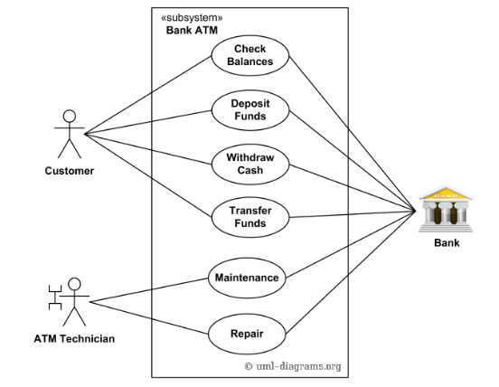

**Use cases**
Objective: Discover and document the functional requirements of the product
    Use cases Capture interactions between system actors to achieve user goals
    Capture who (actor) does what (interaction) with the system with what purpose (goal) without dealing with system internals
    Complete set specifies all the different ways to achieve a goal with the system
    Essentially, it identifies and documents the software requirements to do the user's goal without going into the inner workings of the system
Use case is essentially a user interacting with the system (black box) and the user's objective is achieved

**Use case modeling**
Indentifies who interacts with system
Defines boundries
Gives context and says why system/feature is needed
Easy to understand

*Actor*: Someone/thing outside the system that interacts with it (the ppl/things using the software)
    People that can potentially interact with system
    Other systems that can interact with it
*Use case*: Actions performed by system that reaches the goal of user
    Describe seq of interactions between users and system (success/fail)

As a <user> I want to <do something> so that <something happens>

**Life cycle of use case**
1. Discover a use case
   Ex: Register for classes
2. Give brief description
   Ex: Allow student to register
3. Outline of the events of use case (can include alternative flows)
   Ex: Log on -> Approve log on -> Search for class -> register -> log out
4. Dtailed description of use case
   Longer description under each step of outline
*Include relationship*
Same behavior in multiple use cases/flows (like logging on)

*Extend relationship*
One use case that occurs at certain points (another way of saying if something is true)

*Other concepts*
Inheretiance: relates Specialized and generalized element
    Specialized use inherits has same goals and actors but more specific 
    Arrowhead end

*Multiplicity on association links*
1       1 instance
1..*    1 or more instance
0..1    Optional instance
*       Any number
Default 1

