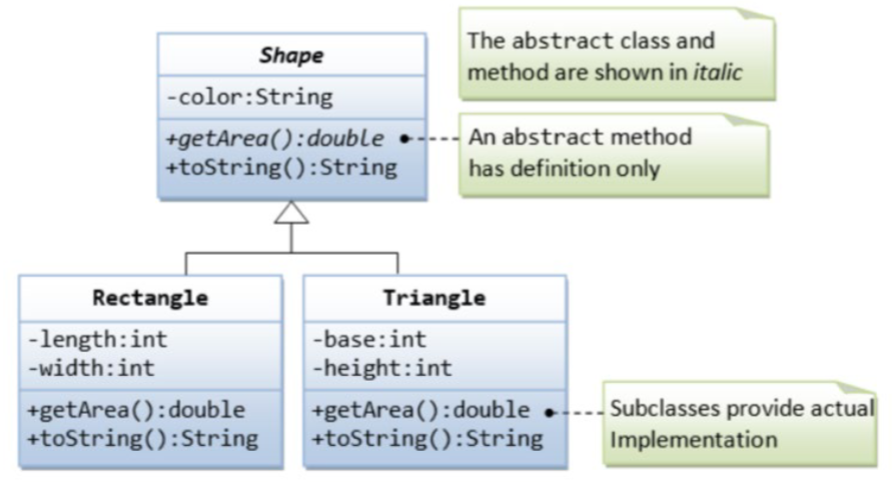
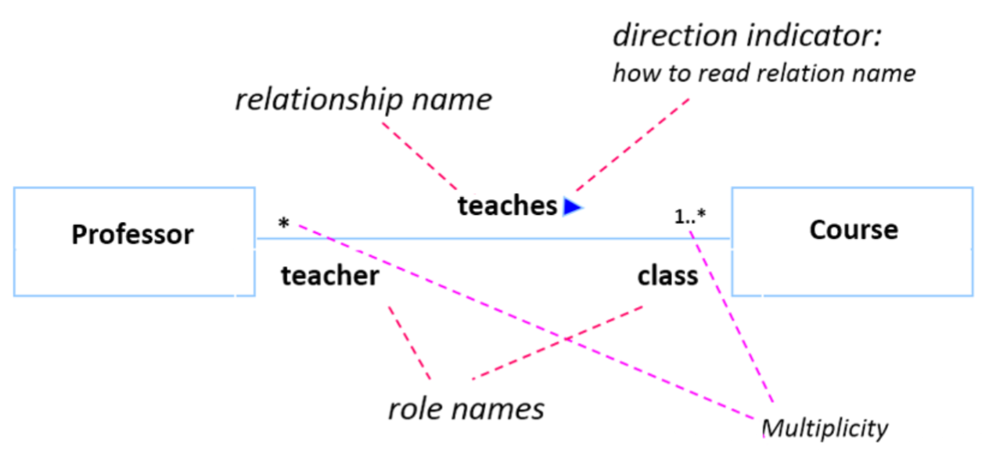
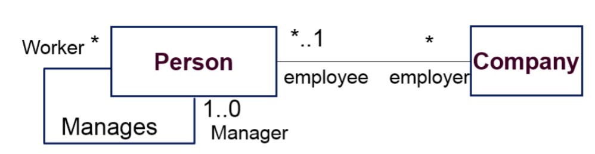
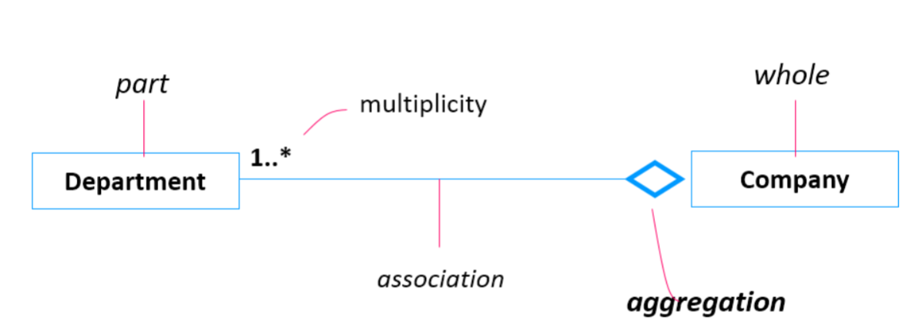
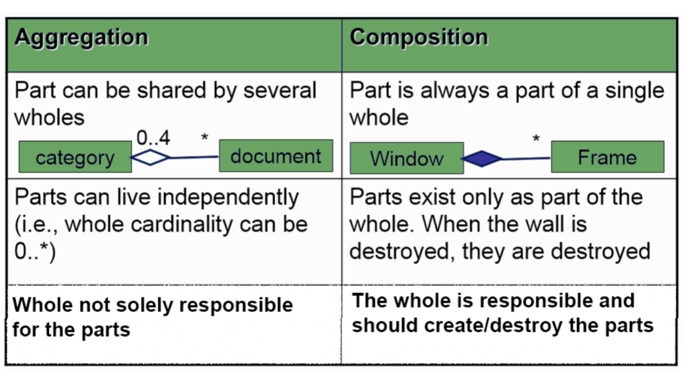

**Use cases**
Summary level
    Represent user goals
    Provides table of contents as well as context
    Ex: Configure database
User goal 
    One person does one thing at one time
    Achieve a single goal
    Ex: Create table
Subfunction level
    Execution support
    Low level
    Ex: Log in

**UML Class Diagrams**
Each box has associations (like inheritance) as well as constraints and multiplicities
Each class has attributes (vars), operations, functions
    Name, attribute, methods, interface, behavior, and default actions
    Defines properties
    Uppercase letter
    *Function properties*: [visibility] name [[multiplicity]] [: type] [=initial value] [{property}]
        Visibility: Access rights
        Multiplicity: How many instances
        type: bool, string, int, unsigned
        Initial value: Default value
        property: read only, add only, const, etc
    Interface or abstract classes are in itallics
        Interface is like when there are subclasses and the main class has empty methods to raise exceptions
        
    Comments are slightly grey dashed lines that point to something specific

**Class associations**

Association
    One class is connected to another by a solid black line
    
    Arrow at one end means that direction only
    *Attributes*
        Name: Identifies association
        Roles: End of each association that refers to associated object
        Direction indecator: Arrow pointing direction to read relationship name
        Multiplicity:
            n       n exactly
            m..n    m to n range (inclusive)
            m..*    m up
            1       1 instance
            1..*    1 or more instance
            0..1    Optional instance
            *       Any number
            Default 1
        Option: Makes it more descriptive
    Reflexive Association
        Class refers to itself
        
    Can be multiple associations from one class to another
    Complex Association
        Represent more elaborate models (x to 1)
    Aggregation Association
        Whole to part relationship
        
        Another example is a folder on your computer
        Can live independantly of each other
        Can be shared by multiple
    Composition
        Always part of single whole
        When whole is destroyed so is the composition
        Whole is repsonsible, makes and destroys
        like a part (engine to a car)
        
Generalization
    Is a superclass (parent) relationship aka Is a relationship
    Ex: shapes