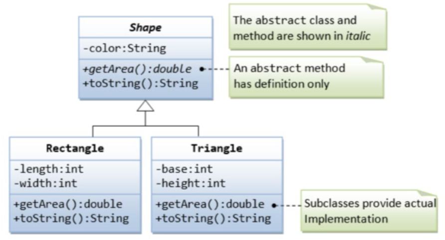
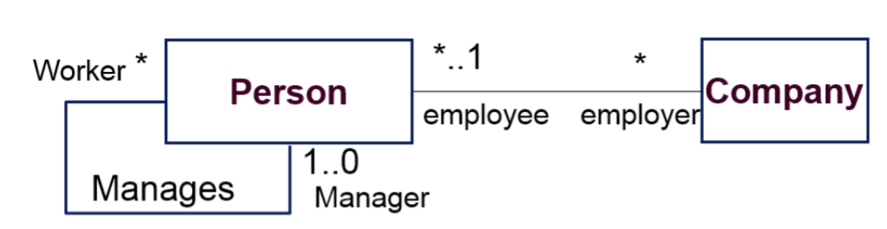
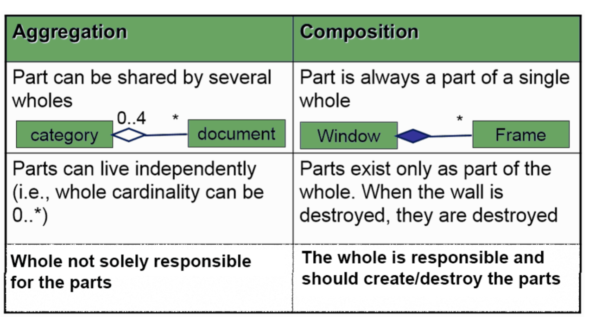
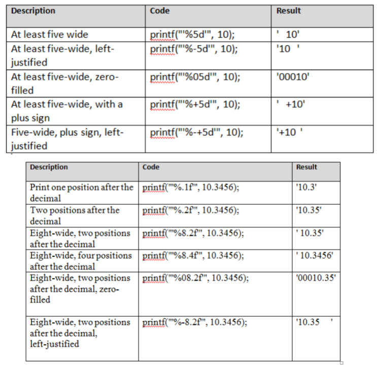

**UML Class Diagrams**
Each box has associations (like inheritance) as well as constraints and multiplicities
Each class has attributes (vars), operations, functions
    Name, attribute, methods, interface, behavior, and default actions
    Defines properties
    Uppercase letter
    *Function properties*: [visibility] name [[multiplicity]] [: type] [=initial value] [{property}]
        Visibility: Access rights
        Multiplicity: How many instances
        type: bool, string, int, unsigned
        Initial value: Default value
        property: read only, add only, const, etc
    Interface or abstract classes are in itallics
        Interface is like when there are subclasses and the main class has empty methods to raise exceptions
        
    Comments are slightly grey dashed lines that point to something specific

**Class associations**

Association
    One class is connected to another by a solid black line
    
    Arrow at one end means that direction only
    *Attributes*
        Name: Identifies association
        Roles: End of each association that refers to associated object
        Direction indecator: Arrow pointing direction to read relationship name
        Multiplicity:
            n       n exactly
            m..n    m to n range (inclusive)
            m..*    m up
            1       1 instance
            1..*    1 or more instance
            0..1    Optional instance
            *       Any number
            Default 1
        Option: Makes it more descriptive
    Reflexive Association
        Class refers to itself
        
    Can be multiple associations from one class to another
    Complex Association
        Represent more elaborate models (x to 1)
    Aggregation Association
        Whole to part relationship
        
        Another example is a folder on your computer
        Can live independantly of each other
        Can be shared by multiple
    Composition
        Always part of single whole
        When whole is destroyed so is the composition
        Whole is repsonsible, makes and destroys
        like a part (engine to a car)
        
Generalization
    Is a superclass (parent) relationship aka Is a relationship
    Ex: shapes13 different types of UML classes

UML Class diagram includes:
    Name, attributes, methods (services, operation, interface, behavior)
    Relationships between classes with arrows
    Class usually begins with capital letter
    Attributes define the properties of the class
    [visibility] name [[multiplicity]] [: type] [=initial value] [{property}]
        Visibility: Access type (+, -, #)
        Type:
        Multiplicity: Amount 
        Initial value: Initial value
        Property: readOnly, const

        – balance: Real = 1000.00
Functions:
    [visibility] name [(parameter-list)] [: return-type] [{property}]
        Parameterlist = paramaters 
        Property: can be abstract

Abstract/interface classes can be italic
Association
    2 functions are related (solid line)
    Generalization
        subclass or subfunction
        Line w hollow triangle
    Dependancy
        1 event depended on the one it points to. 

    Aggregation
        **If an association has an arrow at one end, it is navigable in that end only**

Complete: All subclasses specified
Incomplete: Some subclass specified, but others exist
Disjoint, one or the other
ellipses indicate others

dashed line shows "uses" relationship

Object diagrams are about instances of a class

**Package Notation**
Package: Grouping of elements
Import:Public package brought into namespace 
Access: Public package used but not brought into namespaceUnix created to be simpler and portible
Created by Dennis Ritchie and Ken Thompson
**Language B**
    Based on Basic Combined Programming Language (BCPL)
    Small and simple but difficult to use
**Language C**
    Made by Dennis Ritchie and Ken Thompson
**C++**
    Made by Bjarne Stourstrup 

**Include**
    For including libraries (like importing)

**Preprossessing**
First step
Code expanded so that it is simpler to use
Include files pasted in, macros (#DEFINE) are expanded
Comments remoted and lines joined**STATIC** Global vars, can be accessed throughout program (no scope)
Static data is constant
    Static arrays 0s by default
Compiler turns into binary
Preprocessor expands code so that all the imported libraries are added and so that comments are removed 
Case matters but white space doesn't
{ 
    These mark blocks of code and can alter scope (vars declared here delete after done)

} 

to use libraries you have to import their header files

**Vars**
Float, int, char
String is an array
You have to declare a var before you use it

**operators**
There are many different operators (comparison operators result in 0 or 1)
if (operation) {
    Stuff
}

& is bitwise and but it can also be address of operator 
    It would get the address at where the var is located 
++i increments and then evaluates
i++ evaluates then increments
//suppose i is 5
y = ++i //y is 6 i is 6
y = i++ //y is 5 i is 6

**Scope**
Variables are only accessable directly when they are in the same scope{} otherwise they need pointers or references

**printf**
Is in the #include statement (aka headerfile)

%3d will right justify ints
%-3d will left justify ints
%03d will right justify and have leading 0s (001)

**Arrays**
put [size] after var name to declare an array with that size. 
Arrays of structs, unions, pointers, etc. allowed but it has to be same element
Can also declare a 2d array like this int[a][b] where a is rows and b is columns

*Have to be careful because if you do arr[val] where val>size, C will still try and access that number even though it is out of size*
You can index to access specific element

*automatic array*
int B[20] = {1, 2,3,4,5,6}
    The rest are 0s
int B[] = {1,2,3,4,5}
    AUtomatically makes array with 5 elements
int B[3] = {1,2,3,4}
    Error
sizeof returns # of bytes required

int[2][3] = {1, 2, 3, 4, 5, 6}
    OR
int[2][3] = {1, 2, 3}. {4, 5, 6}**Common IO functions**
printf()    Prints
scanf()     Scans (gets input)  
getchar()   Reads a single char
putchar()   Prints a single char
EOF         Error mentioning end of file (doesn't crash or throw exception)

**Arrays**
Store multiple of the same variable type
C code does NOT check array bounds
Array outside of function is always static 

**Pointers**
*&* Generates a pointer to x (gets the address of value)
* Dereferences a pointer (Gets the value of an address)
Ex: 
p = &c; //p is the address of c
*p = 10 //the address of p contains 10

Pointer is a variable that stores the address of another variable
int *p;
p = &x;
Can be used to access memory location or pass address to a function

type *type; //A pointer to whatever type

Can also have a pointer to a pointer **

C does not check if the pointer is valid
p++ will look at the next int
You can also do address math

**Arrays and pointers**
Arrays behave like pointers
A[10] is a pointer to A[0]
p = A; is legal
p will point to A[0] so *p will give you the element at A[0]
*(p+n) will give you the value at A[n]
p = &A[5]
is the same thing as 
p = A + 5
Both of these make p a pointer to the 5th element

double A[10] sets aside 10 blocks of memory (each large enough for one double)
double *A sets aside 1 pointer sized block of memory

int A[10]
int B[10]
A = B sets A to what B is pointing to. Old contents of A are now unreachable

void func(int a[])
is the same as 
void func(int* a)

Both of these functions are able to change the original value passed through instead of a copy

**CHECK**
while (*t++ = *s++)
This changes t to be the same as s
Whatever t is pointing to is whatever s is pointing to until they aren't pointing at anything

When using cpp, have a building block approach which means reuse code that already exists
In cpp, this includes classes and functions from
    * C++ Standard Library
    * developed by you or colleagues
    * Classes and functions from third-party libraries
Doing this can reduce development time since the already made functions are optimized and made

Compiled programs 
    Compiling takes a while
    Interpreters made to execute programs directly (no compilation) but with the cost of speed
        JS, Python, PHP

**Data:**

Bit: 1 or 0, most basic
Byte: 8 bits
Field: Set of characters (bytes) representing piece of data (Like a word in a line)
Record: Collection of related fields (like a line)
File: Collection of related record

**Concepts supported by OO**
Classes:
    - Attributes (vars) and methods (func)
    - Member function
    - Private, public, or protected
Encapsulation
    - Information hiding
Inheritance
    - Single/double
    - Facilitate reusability
Polymorphism

**C++**
Anything with # is a directive for the preprocessor
main() is a part of every c++ program, where execution starts
Input and output is from streams of characters
std::cout sends a stream of characters to standard output stream object (the screen)
    the std part means the cout function in std namespace

<< is the stream insertion operator multiple << is concatenation 

return 0 means exit safely, a safe exit is getting to the end of the program 

If statements require () around them
using namespace std removes the need for putting std:: prefix

Preincrement: ++i   Increase var by 1 and then use it
postincrement: i++  Use the var then increase by 1

**Control selection**
Sequential structure: Execute one instruction after another
Selection structure: Choice of statements selected to be executed (if/else and switch)
Repetition structure: Do something multiple times (or none) like while, do while, and for loops

For loops are counter controlled repetition structures while while loops sometimes are sometimes aren't
3 expressions are optional but the 2 semicolons are needed

do while executes once and then checks whether to do it again or not

Switch statements are kinda like ifelse blocks when trying to determine a specific value. Breaks needed or otherwise it will cascade down
If there is no match the default will occur

Break leaves the loop
Continue goes to the next loop right awayStructured Programming is easier to understand than unstructured

**Functions**
Functions can have no params either by () or ( void )
Can overload (same function with different amounts of parameters)

**Function prototype** (Function declaration)
Tells the compiler
    Name of function
    Type of data returned   
    numbers, types, and order of parameters BUT NOT THE NAME OF PARAM
    Ex  int myFunc(int, int);

**Function signature**
Name of the function and type of its arguements
myFunc(int, int)
Functions can have same name but NOT signature

**Function header** 
Forward declaration and in header files
Full function except for body of the function
    Ex: int myFunc(int yes, int no);

**Storage classes**
Extern means global across all files it also says it is defined elsewhere
Static is global among the same file

**if else in one line**

(condition) ? if-true : else;
(a>b) ? a : b
if (a>b) then a else b

**scope**
Portion of code where var can be used
Block, func, global namespace, func prototype 

**Function call stack**
The first function that is called gets put into memory and when the function is done the block of memory is deallocated 

**Inline**
Tells the compiler to generate a copy of code every time the function is called
    This is useful because calls are very costly so this copies and pastes the binary values to do it without calling a function

**Params**
Pass by reference
    Passing the address where var is located and you can access and change the data directly
    Use &type to specify pass by reference
    To specify that the reference will stay constant, use the const keyword before the type in the params
    Const after function is saying that the function will not change the object being called
Pass by value
    Copy of the var created and passed
    CHanging the copy doesn't change the original var

**scope resolution operator**
If there is a global var and a local var with the same name, use ::var to specify the global var
Sometimes library:: is needed if it is being done from the same file

**Function overloading**
Several of same functions as long as they have different signatures
Create several functions with the same name that perform similar tasks but on different data types or amounts

**Function template**

template < typename T >
T max(T val1, T val2, T val3)
What this does is that it replaces T with typename and typename just means any var type (you can also specify a type)

**Type casting**
Types will be auto-convert (cast) from one type to another type
The types have to be compatabile 

**Classes**
Classes encapsulate:
    Set of data items and structures (data members)
    Set of operations (operation members)
        Aka functions, methods, services, behavior
    Can be private or public
Defines an abstract data type
Constructor is how to make the class object

*Access specifiers*
Public: Anyone can access (even the one using the class)
Private: Only member functions can access (the user cannot directly access)
Protected: Similar to Private

*constructor*
Initializes the class object (what to do when the object is made)
Cannot return anything
Same name as class
Member vars can be initialized by constructor either now or afterwards
*Destructor*
Deletes the class object (what to do when the object is deleted)
Cannot take arguements or overloaded 
denoted by ~

**Working with classes**
use object.method when working directly with the object
use object->method when working with a pointer to the object

To define a method you do
    Type Object::Funcname()
    int Time::getTime()

*Initalizing objects*