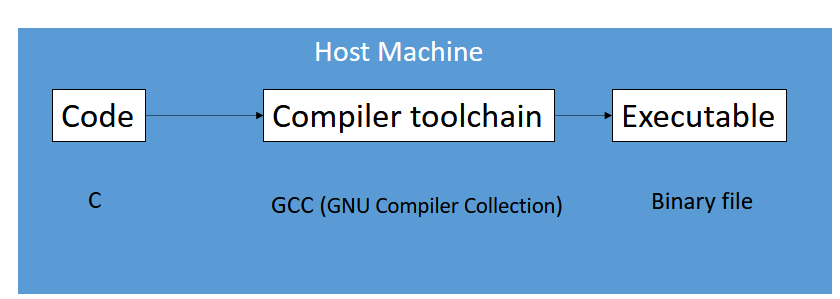
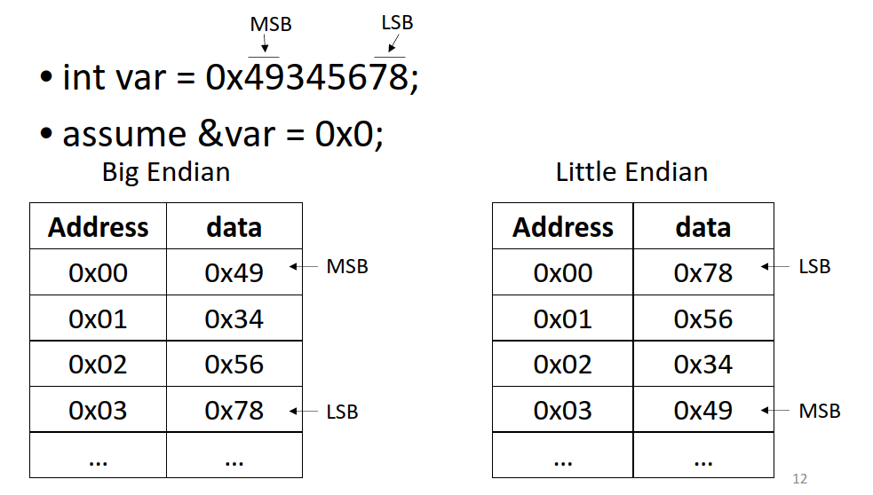
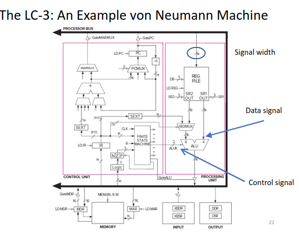
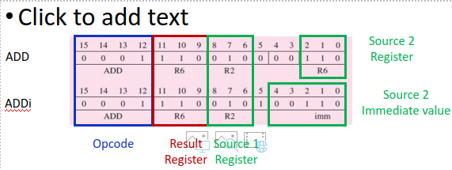
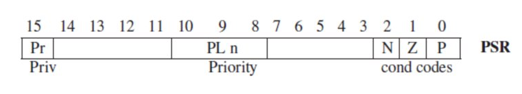
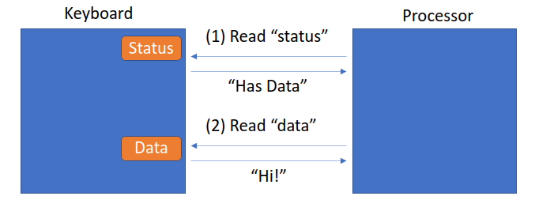
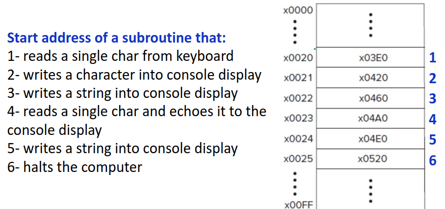
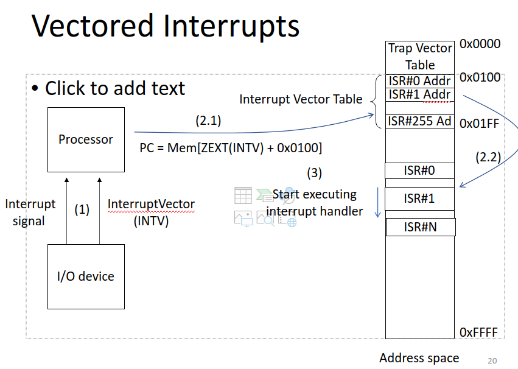
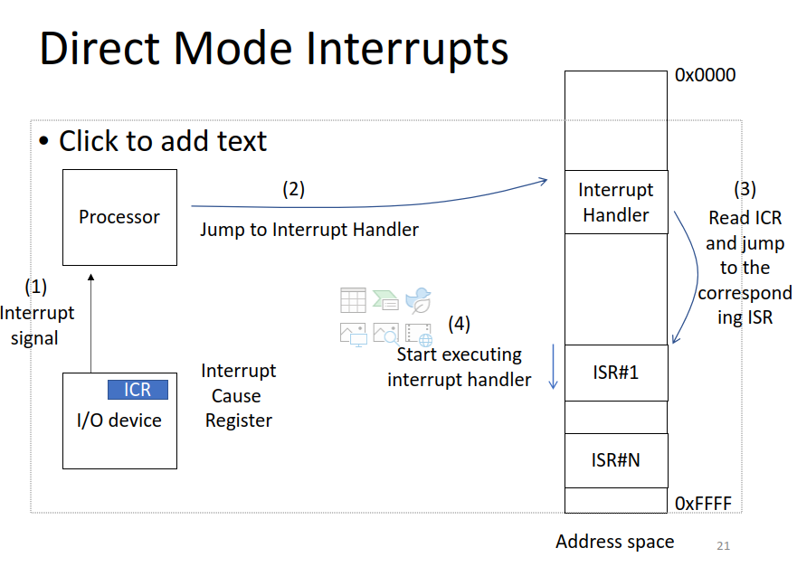
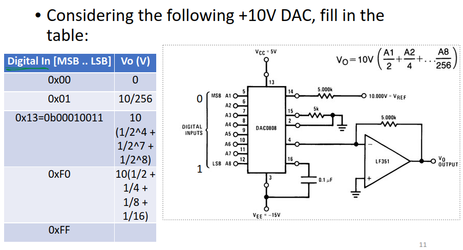

# Lec 1
***Embedded Systems: communication between different parts of computer for a specific purpose***
        *aka cyber-physical, Internet of Things, real-time systems*

Cyber-Physical systems: Computer + Physical system **NEEDS CORRECT VALUE AT RIGHT TIME**
1. Performance: need to be fast
2. Efficency: need to be not too hot/expensive
3. Safety: need to work
4. Security and Privacy: need to be safe

Correct Value at wrong time is a fault
Embedded systems are NOT end-user programmable

# Lec 2
Operating system isn't needed but makes life a whole lot easier

## Instruction Set Architecture (ISA)

ISA is the vocab of computers \
Defines interface to processor \
Decouples usage and implementation \
    Ex: ARM, x86, RISC \
Software layers in ARM allow for backwards compatibility

There is a debugger between embedded system and host machine \
The host machine usually has build enviornment because target has less resources



## Compiler Toolchain

The code that you write --> <preprocessor> --> macro (replaced all #DEFINE and stuff) --> <compiler (gcc)> --> Assembly Code --> <Assembler> --> Machine code --> <linker> --> .exe file
C becomes binary


Native compilation: Compile and run on same system

Cross compilation: Compile on one system and run on another system

## Make file
Controls the generation of executables, triggers preprocessing/compiling/assembling/linking in order to make an executable \
Widely used standard which is neccesary for keeping things the same 

## IDE
Autogenerate Makefiles \
Simple interface for developers \
Profs have own make files because bad for sustainability and collaboration (we don't know the make file) \

## Version control system
Software that allows tracking changes (like Git) \
Allow better collaboration

# Lec 3
## C
Embedded systems mostly use C because allows memory management, optimizations, etc while still being effecient to code in
> **8 bits = 1 byte** \
> 8 bits is 8 0s in binary or 2 letters in hex

## Data types
    1. integer: int, char
       - Int is 32 bits or 4 bytes
       - Char is 8 bits or 1 byte
    2. Floating point: float, double
    3. Void: FUnction return type and universal pointer types
    4. Derived types: Pointers and arrays
## Modifiers
    1. Short: half bits
    2. Long: Double the bits
    3. Signed: Normal
    4. Unsigned: Only positive
## Type Qualifier
    1. Const: Value of var can't be modified
    2. Volatile: Re-load register from memory every access 
        Important because embedded systems can change value of variable without the processor knowing so any var linked to an embedded system should be 
## Conversion hex/decimal/binary 
Hex to binary, each number is 4 binary digits \
hex to decimal \
2s complement is used for signed integers, the first digit is negative and the rest are positive. If the first digit is 1 then it is negative

## Float and double
**Float**: 6 significant decimal bits of precision \
**Double**: 15-17 significant bits of precision

## Operators 
- & bitwise and
- | bitwise or
- ~ bitwise complement
- ^ bitwise xor
- ++var: Increment then use var
- var++: Use var then increment
- \>> move 2 bits to the right (add 2 zeros to the front)
- << Move 2 bits to the left (add 2 zeros to the left)

## << and >> bitwise operators
For unsigned ints and chars, add 0 to left or right \
For signed: \   
*   If it is a positive number or << , treat it the same    
*   If it is a negative number and >> , add the significant digit (1) to the end

## Pointers

Pointer stores address of memory, declared and derefrenced by *

int *ptr; pointer var declared \
int var = 10; \
ptr = &var; Pointer points to where 10 is located \ 
*ptr = 20; The value at the address is now 20 \
**VAR IS NOW 20** \
& is address of and thats how you assign a pointer

You pass functions through using pointers

# Lec 4 (Von Nuemann)
5 FUndamental components
* Memory: Stores stuff
* out/input: Perefrial
* processing unit: ALU, math done here
  * Instruction register: Current instruction being executed
  * Program counter: Address of next few instruction to be executed


## Von Neumann computer model
* 5 FUndamental components
* Memory: Stores stuff
    * Memory: Gets from input and CU
* out/input: Perefrial
    * Input: Keyboard, mouse, etc. Gets input from CU
* processing unit: ALU, math done here
  * Instruction register: Current instruction being executed
  * Program counter: Address of next few instruction to be executed

### Memory:
    - Contains bits that stores instructions and Data
      - Instruction: Smallest piece of work carried out by computer
        - The instruction is either completed or not completed
        - Can't do a part of an instruction
    - Each location has address (memory location) and content (bits stored at ____ memory address)
        - Address space: The amount of memory you can save (2^n)
        - Addressibility: # of bits stored at each address (usually 8 bits/1 byte)
    - Content: bits stored at each address
    - Accessed through Memory Address Register and Memory Data Register
        - If write:
            CPU loads address of memory it wants to write to in MAR
            CPU loads data it wants to write into MDR 
            Data from MDR is written to the memory location stored in the MAR
        - If read:
            CPU loads address of memory it wants to load into MAR
            The memory accesses the data at the address in the MAR
            Data accessed is transferred to MDR
            CPU reads the data from the MDR
            
            Essentially: Memory reads MAR's content to MDR (MAR is a pointer) then CPU reads the MDR
## Little vs Big Endian
                                Ex: 987654321
    - Most significant byte (MSB) is the largest number, in this case 9
    - Least significant byte (LSB) is the smallest number, in this case 1
    - Little Endian is the LSB is at the lowest address (0) and MSB is at the highest address
    - Big Endian is the MSB is at the lowest address (0) and the LSB is at the highest address
    - It doesn't really matter you just have to know which one your pc is.



## Processing Unit aka CPU
Word Length: Length of instruction in bits (16 for LC-3 and 64 for x84) \
Arithmetic and Logic Unit (ALU)
- Math and logic functions
- Word length, 64 or 32 bit
Registers
- Small temp storage close to ALU
- Results of ALU
- Prevent long latency accesses to memory
- Fast but small
- Register file: Structure in CPU with all registers for reading and writing not storing
  - One file has all the registers
  - Special Registers: Specific roles not for data computation Ex: Stack pointer MAR and MDR
  - General Registers:General purpose for operations

## Peripherials
- Input and output devices to get data in and out of computer
- Each device has its own registers


## Control Unit
- Program Counter (PC) and Instruction Register (IR)
- IR: Current instruction being executed on the CPU
- PC: Address of next instruction
  - Also called *Instruction pointer* by Intel because it is a pointer to the next instruction

## Control unit
Reads address from memory from address stored in PC \
Stores into IR \
Decodes it and the sends signals to other component \
Tell other components what do to \


## Multiplexer
Takes in multiple inputs and has one output

## instruction
    Smallest Unit of execution Instructions are sequence of bits with 2 pieces of information
        Opcode: operation (+, !, >=)
        Operands: data to be used
    LC-3 has 15 instructions
        opcode: 4 bits needed
        operands: 12 bits left
        Also 6 data movement instructions
    Add instruction
        3 operands: 2 numbers that will be added and 1 destination (sum)
        >= 1 operands are from register and result stored in register
        Ex: ADD R3, R1, R2 is R3 = R1 + R2
        2 source registers are used to get information and then a destination register is used to store the result
        If bit number 5 is 0 then ADD elif 1 then ADDi (Add but 1 var and 1 immediate value)


## OPCODE LD (Load) 0010
Go to a memory address, read it and store it to a specified register so that it can be used for instructions \
Address (or destination register) = PC (Program Counter) + sign extended bits [8:0] to 16 bits
## relative addressing
addressing in relation to the PC (+- 256)
Only works close to PC
## Instruction processing
    1. FETCH: Read instruction from memory into the register abd Increment PC
    2. DECODE: Decode the instruction type
    3. Evaluate address: Generate Memory address for accessing memory (optional)
    4. FETCH OPERANDS: Read operands from register file or memory
    5. EXECUTE: execute operation in ALU
    6. STORE: Write results into register file or memory

## FETCH
    Obtain next instruction from memory into IR 
    PC points to the "next instruction" in the memory
    1. LOAD Memory address register with PC and then increment PC (so PC points at next instruction)
    2. Instruction loaded from memroy to Memory Data Register
    3. Copy MDR to IR
    NOTE: Each step is one machine cycle (4GHz is 4 billion clock cycles per s)

## Decode
    First Determine instruction type  
    4 bits 
    Ex 0010 for load

## Evaluate Address
    Only for memory address instructions like LOAD
    For LD, extends bits and adds to PC to determine what address is needed

## FETCH OPERANDS
    Get source operands to process instruction
    Ex: ADD, read from reg file
    Ex: LD, Load address to MAR then interrogate memory

## EXECUTE
    Does the instruction (not needed for LD)
    Also changes condition codes

## STORE RESULTS
    Result written to destination
    For add, updates reg file
    Not always needed

## Changing seq of execution
Control instuction: Change seq of instruction execution like branches
### Conditional branch instruction in LC3 
0000 opcode
#### condition 101
Take branch if prev instruction result is not 0 

In 101: First digit is negative, second is zero, and third is positive \
So 001 would be take branch if prev instruction result is positive \
First 4 digits are for the BR instruction, next 3 are for condition, last 9 are for number -6 \


# Lec 5 LC-3
## Instruction Set Register
* Memory organization
  * 16 bit addressability (2 bytes) 
  * 2^16 address space 
* General purpose register 
  * 8 of them and 16 bits each 
  * Accessed in 1 clock cycle
  * Does math and stores info
* Availible Instruction
    * Defined by OPcode, data type, and addressing mode
    * 15 opcodes, 1 reserved in LC3, 19 total instructions (some share)
    * 2s complement
    * *5 modes*
        * Immediate
        * Register
        * PC Relative (memory)
        * Indirect (memory)
        * Base + offset

## Condition Codes
* NZP: NEgative, Zero, positive
* Each time operate or load is e the codes are set
* Dependant on the result of the last instruction 

## Operations 
Only add, and, and not \
To Subtract you need to NOT the second number, add 1, then add it to the first \
### Immediates
Dont get value from register, they use the given value \
R3 = R2 + 5 \
Bit 5 declares immediate or not
### Subt
To do R3 = R2 - R1
    Not R2 to get 2s complement
    Add 1 to R2 so that R2 is now negative original number
    Do R3 = R2 + R1 
### Load effective address
Load Destination Register with PC (Program counter or current instruction) + SEXT(8 bits)

## Data Movement Instruction
Moves data between reigster, memory, and IO devices \
Load: Memory to register \
Store: Register to memory \
OPcode, source, and destination needed \

2 Operands: 
* 1 source: data to be moved 
* 1 destination: WHere the data is moved to \
One operand is a register and the other is a memory location or IO device
### PC Relative mode
LD and ST
Address = PC + SEXT(bits[0-8])
Limited range ([255-256]) of PC

### Indirect Mode
LDI and STI \
Address = Mem{PC+Mem[SEXT(bits[0-8])]} \
Address not limited because Memory at sext can be anything 

Add Offset to PC then go to that address. Go to the address at that address and get the value from there  \
### Base + Offset
LDR and STR \
Address = SEXT(bits[0-5]) + Reg# 

Add 6 bits to whatever register to get the value 
## Control
Alter sequence of instructions \
5 types
* Conditional Branch
* Unconditional Jump 
* Subroutine (function) call 
* TRAP (service call)
* RTI (Return from trap or interrupt or function)

### Conditional Branch (BR)
OPcode 0000 \
Tells whether to execute next instruction in sequence or out of sequence \
This decision is based off the results of the previous instruction \
Control codes are n, z, p, at bits 11-9 respectively 
 \
If last instruction is 0, jump x0D9 spaces 
### Unconditional Branch (Jump)
Unconditional jump \
Execute next instruction from Mem[Register base] \
So if R2 = 00FA the next instruction is from 0x00FA

## Trap instruction
Invokes OS call \
Bits[0-7] (trap vector) identify which service call \
Once done, PC looks at the next instruction \
    Ex: Read char from keyboard, write char to screen

# Lec 6 LC-3 DataPath (Not on test)
* 5 basic components of LC path
    * Global Bus
    * Memory
    * ALU and register file
    * PC and PCMUX
    * MARMUX

## Global Bus
* Bus is shared, must be multiplexed because multiple components are using it
    * Good because 1 wire works for multiple
    * 16 bits in one wire
    * Loaded from by LD.X
* Point-to-point interconnect is one to one and doen't need to be multiplexed
* Tristate device
    * Switch for on/off
    * Allow only one supplier for bus
    * When component doesn't need, it essentially disconnects
    * Most components that use BUS need
## Memory
* Read to MAR
* Read/Write To/From MDR
* Tristate GateMDR
    * Tells when to write read or do nothing

## ALU and Reg File
* ALU Sources
    * Register or SEXT
    * Controlled by IR[5]
* Condition codes
    * Comparator logic, results of ALU
    
* Signals from FSM

## PC and PC MUX
* FETCH stage: Add 1 to PC and use prev PC to find next instruction and write it to next register
* PC MUX helps chose whether it is +1 or +SEXT depending on branching

* Instruction cycle
    * Fetch (load IR)
    * Decode
    * Evaluate address
    * operand Fetch
    * Execute (not required)
    * Store result


# Lec 7 Assembly
## General Info
High level languages
    Java, C++, C
Low level language
    Assembly
    ISA dependant (machine)
    mnemonics for opcode (0001)--> ADD


## ASM
lines with ; are comments
Instructions tell computer what to do

### Instruction
    Label Opcode Operands ;comment
    Again Add R1,R2,R3    ; Adding R2 and R3 to R1

### Labels
    Symbols to identify memory location
    1 to 20 alphanumeric chars
        start with a letter
        Except seq that cause ambiguity
    Reasons
        Target of a branch
        Location that has a value in memory
    Essentially allows code to jump to a different part

### Psuedo Ops
Helps assembler translate memory to ISA

**.orig**: Where the program starts the program (.orig x3050 means first address is at x3050) \
NOTE: This does not mean the start of the program is right below the .orig \
REQUIRED 


**.fill**: Initialize memory to a number/label \
SIX .FILL x0006 \
Essentilly makes a var Mem[SIX] = Mem[0x3058] == 0x006 


**.BLKW**: sets a side block(s) of memory \
NUMBER .BLWK 2 \
reserves 2 spaces for NUMBER \
Used for arrays and such \
Next instruction is 2 blocks away 


**.stringz** \
Initialize n+1 memory locations with 0 extended ascii code of characters in the input string \
Each ascii is a different  \
String closed with null char (0x0000) 


**.end** is the end of the program (different from HALT) \
doesn't translate to machine code \
Tells assembler no other instruction 

# Lec 8 Assembly Instructions
## Operators
**ADD** \
ADD DR, SR1, SR2 \
ADDi SR, SR1, imm5 \
Adds depending on bit 5 \
and then sets condition code 

**AND** \
Same thing as above

## Branch 

**BR** \
nzp: last instruction was negative, zero, or positive respectfully \
Jumps to label (or offset) if condition is true \
BRnp LOOP \
    > If last instruction was negative or positive, adds LOOP to PC and goes to it \
Limited to -256 to 255 \
Remember: PC is at 1+current address \
to loop to the current instruction offset is -1 

## Jump instructions
**JMP AND RET** (Jump and return from subroutine) \
PC counter becomes some address \
Return always uses R7, JMP uses the specified address \
JMP R1 \
RET \
Jump to address stored in register 1, returns to whatever is stored in R7 \
JMP does not store to register 7, JSR\JSRR do \
*JSRR jumps to an address stored in register JSR jumps to 11 bits offset of PC*

**JMP** Jump \
Ret: implicitly uses R7 so don't change R7 \
**JSR/R** Jump to subroutine \
Change in bit 11 specifies whether JSRR or JSR \
Stores next address in R7 to be used by RET 

JSRR jumps to the address specified in the given register while JSR adds given offset to PC \
Returns to RET after subroutine is done \

*JSR/R Jumps and implicitly changes R7 while Jump doesn't store PC into R7 automatically* \
Used for functions and stuff \
You can get into an infinite loop because RET will keep going back to R7 \
To stop the loop put the subroutine after the halt

## Load
**LD** Load \
Label is a number \
Destination Register = Mem[PC + Sext(Label)] \
Between -256 and 255 of PC 

**LDI** Load Indirect address \
DR = Mem[Mem[PC + SEXT(offset)]] \
You get the address at the memory address of PC+offset \
Essentially whatever is at PC + Offset is a pointer to the actual value

**LDR** Load Register \
DR = Mem[BaseR + SEXT(offset6)] \
You add register to offset \
Essentially just getting the value that is at: specific register + SEXT(offset6)

**LEA** \
DR = PC + SEXT(offset) \
No Memory access

## Store
***ST IS SAME AS LOAD BUT STORING INSTEAD OF GETTING VALUE*** \
**ST** Store (Changing value at address) \
SR = Mem[PC + Sext(Label)] 

**STI**  \
SR = Mem[Mem[PC + SEXT(offset)]] \
Whatever is at PC + Offset is a pointer to the actual value

**STR** \
SR = Mem[Base Register + Offset] 

## Trap
**TRAP** System call
location 0000 to 00FF (trap table)


# Other notes for Midterm 
Addressibility =/= more space

Addressability: The number of bits that a machine can address at its smallest data unit, often a byte or word. \
Address Space: The total amount of memory locations that can be addressed by a computer system, determined by the number of bits in its addressing scheme.

# Lec 9 OS
## Trap (System Call)
Tells the OS to do something like HALT
## OS
Give users resources while stopping the user from harming the memory or programs
### Privilige
Right to do something \
Also used to prevent user from accessing needed memory \
Ex: Don't want users to call HALT or alter memory that's required for running
* Program in supervisor mode is privileged 
  * Can access all instructions and memory address
  * sudo
* Program in user mode is unprivileged
  * Can't execute privileged instructions or access privileged memory addresses
### Priority
Urgency to do something compared to other programs
Unrelated to each other

Ex: \
    Info from sensor: no priv but high priority \
    Info from keyboard: priv but low priority

### Processor status register
Each program has two registers, PC and PSR as well as NZP condition codes
 \
Exists in IO Page

### Memory Space
    Made up of:
    System Space            Priv 
    supervisor stack        Priv
    User space              User
    User Stack              User
    I/O page                Priv
    IO Page is also where memory mapped Registers and IO is at
**Stack**
* Temporary space for Functions
* Grows and shrinks dynamically
    * Call a function and it grows, remove a function and it increases
    * Grows until reaches a max specified by the operating system


# Lec 10 Subroutine
## Subroutine
Essentially just a function \
Call by using JSR or JSRR and then return by using RET (or JMP R7)

Writing to register means losing previous value \
We need to save the registers elsewhere (in memory using ST) 

**JMP**
Jumps to a different address 
Does NOT store the PC into R7

**JSR**
Same thing as JMP but stores PC into R7 for it to be used by RET

**JSRR**
Same thing at JSR but instead of jumping to a LABEL it jumps to an address stored by a register


# Lec 11 IO
__***Everything in a computer is controlled by instructions in the ISA***__ 
## Question 1: Does ISA Nee need Special instructions for controlling IO 
* 2 registers used
    * Data register: Hold the data being transferred
    * Status register: Status of the device (busy, sleep, needs attention)
* 3 types of instructions (IO sometimes needs its own)
    * Operate 
    * Data movement 
    * Control Flow
* ISA needs special instructions and controls literally everything
* Special IO instruction
    * instrX <Operands>
    * Identify
        * Which device, operation, operands
    * 1965 DEC PDP-8 Computer
* Data movement instructions are also used to interact with IO
  * LOAD from IO register to input
  * STORE to IO register to output
* LC-3 Uses memory mapped IO 
  * Stored in Device Register Addresses
  * Each spot in memory is doing a different thing

* CPU communicates with IO device via 
    * Data register: The ascii code of the keystroke
    * Status register: tell whether keystroke happened

## Question 2: Does IO device need to work at the same speed as the processing unit?
IO device is slower than processor
Option 1: Processor that reduces frequency of talking to IO device (EX: accept at every 200m cycles)

### Synchronous vs Asynchronous IO
* Synchronous
    * Fixes speed IO device
    * Reads in fixed intervals (reads every ms or ever 5 ms)
    * Used for RAM and CPU (DDR5)
* Asynchronous
    * Used when Speed varies
    * Hand shake protocol
    * Read status then read data or write to data
    * 

**Polling vs Interrupt Driven**
Polling: Processor checks the status register periodically
Interrupt: Notification from IO Dev
     

## Question 3: Is IO transfer Initiated by a program or IO Device
 **Polling**: Processor checks status register \
 **Interrupt**: Notification from device


# Lec 12 TRAP (System Call)

Programmers need to know about low level but shouldnt access because they might mess something up \
If device registers are shared it might lead to security issues

Driver is the code that allows access to IO devices

TRAP: Request from OS running in privaleged mode
Executed with a trap vector

## TRAP Mechanism
    Service Routine         Function that executes on the behalf of the user by the OS (placed in system 
                            address space)
    TRAP Vector Table       Table of addresses for each routine (Address to get char is 0x5033 but that address is located 0001)
    TRAP Instruction
        1. Push PSR and PC to the system stack (Saves the current state before starting TRAP)
        2. Set Privilege in PSR to 0 (Gives full access)
            0 is supervisor mode while 1 is user mode
        3. Set PC = mem[ZEXT(trap vector)] Trap vector is sign extended and points to an address and the PC is set to this address. The next instruction is the service at this address
        4. Execute service routine Now executes the routine     
    A Linkage (returning from TRAP instruction)
        Pop 2 values from call stack (PSR and PC)
        Set PSR bit 15 to 1 (Set privilege to user mode)





# Lec 13 Interrupt
## Polling vs Interrupt
    Polling
        CPU periodically checks IO device
        Waste CPU cycles but fast
    Interrupt
        IO device notifies CPU
        Save CPU cycles but slow

    Hybrid mode that switches

    Interrupt
        Like a notification for CPU
        Hardware interrupts (timer, disk, keyboard)
        Software interrupts (interprocess communication)
        Exceptions (divide by 0, seg fault, stack overflow)

## Interrupt vs TRAP
Interrupt is notification for processor

Interrupt causes CPU to run unexpected code
    Showing a warning
Trap requests service from OS to run expected code

## Causing the interrupt 
### Conditions for having an Interrupt 
1. I/O requires attention
2. I/O device has right to request a service
3. Servicing the IO device is more important than current operation


### IO device needs to be serviced
* A bit (the MSB) is set to 1 when the device is ready
* The second bit is an enable bit which the user can enable/disable depending on whether the user wants input
* The 2 bits are anded and the interrupt is processed if the output of and is 1
### Urgency of Interrupt
* Each program runs at a specific priority level
* For the interrupt to go through, the priority level should be higher than the current priority
    * There is combination logic to determine priority level
    

Interrupts can happen at any time of the Instruction processing phase but handled in the instruction boundry

## Handling Interrupt
3 steps:
1. Initiate interrupt
   1. Save the state of the current program in the supervisor stack to go back to
   2. Load the state of the interrupting program
2. Service Interrupt
   1. Do what the instructions say to do
3. return from interrupt
   1. Restore the state of the program by popping the PC and PSR from supervisor stack

### Vectored interrupt
- Interrupt vector provided by interrupting device
- Used by the processor to look at the interrupt vector table
- The table has the start addresses of memory locations with the start of an interrupt service routine
    - Interrupt service routines are fragments in memory that service interrupt events

### Direct Mode interrupt
- The Interrupt handler jumps straight to the corresponding ISR so it starts doing it right away



## Control and status registers
    Privilege registers for software/hardware communication 
    Have special instructions to read and write

    hart = HARdware Thread
        Interrupt related CSRs:
        - Mstatus: Hart current status
        - mtvec: Base address of interrupt vector
        - mie: enable/disable specific interrupts
        - mip: Which interrupts are pending
        - mcause: what caused the interrupts

# Lec 14 IO Interfaces
## General purpose IO (GPIO)
    Programmable digital input/output
    Voltage to represent digital signals
        3.3V for 1
        0.0V for 0
    Useful to interact with devices

    Ohms Law: I * R = V
        V: voltage
        R: Resistor
        I: Current

## Serial vs Parallel interface
Serial uses a single line that sends a stream of info

Parallel uses multiple lines that all simultaneously send info


- Serial interfaces
    - Fewer pins and wires
    - More scalability
    - Lower power
    - low bandwidth (bad)
    - Ex
      - USB 
      - Sata
      - I2C
- Parallel interfaces
    - More pins and wires
    - Less scalability due to synchronizing lanes
    - Higher power consumption
    - more bandwidth (good)
    - Ex
      - PCIe
      - DDR
    
## Transfer types
Simplex:  1 to 1
Half duplex: 2 to 2 through one lane, can send or recieve but not at same time
Full duplex: 2 to 2 through 2 seperate lanes, can do both at same time

## Synchronous vs Asych
* Synch:
    * Common shared clock
    * High throughput
    * Low scalibility
    * Block of bites at a time

* Asynch: 
    * No shared clock
    * Asynch start/stop
    * Self-clocked, based on agreement between transmitter and receiver 
    * 1 bite at a time

## Serial communication standard RS-232
* Asynch because no clock signal

* Introduced in 1962 to connect teletypes to modems 
* Electrical signals and teletypes standard
* 1 represented by -3 to -15V
* 0 represented by +3 to +15V

Essentially, it is a stream of bits starting from a start bit (always 0) all the way to 2 end bits with an optional parity bit (also not sending anything is just 1s)
* Ex:
    * 0 101110100 1 11
    * The first bit is a start bit 
    * The 101110100 is the data
    * 1 is the parity bit (used to check for data correction by checking if the number of ones is odd or even, 1 if odd 0 if even so amount of bits should always be even)
    * 11 is the stop bit
* The data is scrambled (the first bit might be the LSB) so flip it

* goodput is used bits in data /12
* 12 bits is transferred in one frame 

## UART (uses RX 232)
* Convert parallel content of 8-bit register to a bit sequence ready to be transferred over a serial port
    * Baudrate is the speed at which information is being sent (can be anything)
* Both sender and receiver have to have agreed upon transmission
* Check if TX FIFO is not full, if it isn't full, send a byte
* 4 bits of overhead when sending info 
* So to send 8 bits you will actually send 12
## Types of Network
* Point to point: 1:1 communication
    * Faster when direct
    * More scalable
* Bus: shared, needs arbitration
    * More effeceint but slower
    * Master: Starts transfer
    * Slave: Cooperates with master


## I2C
 \
* Inter-integrated Circuit protocol 
* 2 Wires used
    * SDA for data
    * SCL for clock
* Standard speed is 100Kbps
* Ultra fast speed is 5MBps (50x faster)
* Serial synchronous bus
* 7 or 10 bits for slave address: 128 ~ 1024 devices 
* Bus interconnect


Start condition: When SCL is high, SDA high to low \
Stop condition: When SCL is high, SDA low to high \
Address frame is for the slave to know whether it recieves or not

* The master controls the bus because the slave cant write without the master's permission
* ACK/NACK
    * If read the master sets the ack/nack but if writing the slave sets the ack nack
    * Whoever is getting the info sets the ack nack
    * The first ack/nack is set by the slave because the slave has to receive the read/write instruction
* 8 bit granularity
* Every data frame is 8 bit but you can send as many as you want (along with ACK/NACK bit) until the master says no more


## **SPI** Serial periphrial Interface
Synchronous serial communication protocol \
4 lines full duplex, over 10 Mbps \
1 master but many slaves \
No start stop bit \
Fast short distance communication


 \
SCLK is the serial clock which the master sets to control communication \
SS is the slave select which selects which slave to use 

 \
Master shifts out to MOSI (Master out slave in) for writing \
Slave shifts in from MISO (Master in slave out) for reading \
Slave shifts in from MOSI and out to MISO so it can transmit and recieve at the same time


## **USB**
Point to point serial communication \
One host multiple devices, can form a tree \
Two wires for single differential signal

No changes in signal means 1, 0 when there is a change in signal it is 0 \
This is done so that USB can handle noise due to electromagnetic interference allowing for longer communication.


# Lec 15 IO Devices ADC DAC
>*__LOW IS ONE__*
## ADC DAC

> **ADC**: Analog to digital converter \
**DAC**: Digital to analog converter \
Digital inputs converted to current \
The current provided by Iout is a function of input binary numbers and the reference current


## Operational Amplifier (OpAmp) Not on test
Amplify electrical signals \
2 inputs
- Inverting input (-) 
- non inverting input (+) 

Negative feedback: Output fed back to inverting input in order to stabalize \
High impedance at input and low impedance at output \
OpAmp equalizes by making the - the same as the + by lowering the output voltage \
EX:     If 1 is the input, then the - will also be 1 and the output would be 2 (I think chatGPT says otherwise)

## IO Considerations
Serial vs parallel
wired vs wireless
Speed
Real-time/QoS guarentees
Power/Electrical requirements
Reliability


## Digital to Analog Conversion
8 bit input, V(A1/2 + A2/4... A8/256) \
Where the An is 1 if the input is 1 \
> __***GPIO 0 is ALWAYS LSB***__



## Step ramp

Its a function that goes up by integers (truncation) 

HiFive has a 32 bit register but we only want to change the last 8 bits (LSB) \
So we get current value of the register and AND it with FFFF00 so it resets the last 8 digits to be changed \
Then it is ORed with the ramp (ramp can only be a max of 256 because thats how many bits there are) and the register is set to the new value 

This is done n times with ramp increasing so that the voltage slowly increases 
(io devices slide 12)

This also assumes the DAC is for bit 0-7. If it is 8-15, do FFFF00FF for the anding if it is 8-16 (exclusive)

If voltage input is less, the Voltage Reference gets lower too and so does the step size (mV)

**NEED TO KNOW BIT MANIP**

## ADC (Analog to digital converter)


### Timing
    CS = Active low signal (Master to slave)
    When it is low, device is ready to start accepting communication
    WR = Write (Master to slave)
    Start conversation (high to low)
    D0-D7 The data lines where data comes from
    INTR = Interrupt (slave to master)
    High to Low says communication completed and ready to read data
    RD = Read
    Telling to read the data (high to low is reading data)


# Lec 16 Motors

## DC Motors
Magnetic fields to convert electrical energy to mechanical energy \
Speed controlled by voltage

### Brushed
- Current provided with two magnetic brushes that are north and south
- The stators (the stuff that moves) is opposite when attracting and same when pulling to move motor
- Windings wrapped around rotator teeth
- Cheaper, shorter lifespan
### Brushless
* Permanent magnetic rotor
* Windings around stator polls with microcontroller 
* More expensive, longer lifespan

## Control speed

### Pulse width modulation
- Speed of motor directly proportional to supply voltage
- Control power delivery by turning power on and off super fast
- Duty cycle (portion of on) Time on/Time off * 100%
 \
In this case the T'/T is the Duty cycle

## DAC vs PWM
DAC used when sending information (Generating sound), when you want smooth and continous information \
PWM used for controlling power or speed (LEDs for speed, moving motor)


## Servo motor
- Electrical device to control linear/angular position/velocity precisely
- Gets positional feedback
- Angle = f(PWM duty cycle)
    - ex: on for 1ms is 0 degree, on for 2 is 180
    - Like the one used in lab


## Stepper motor
- More accurate allowing fractional turns or n revolutions
- Low speed and torque
- Rotational angle proportional to input pulse
- Move in steps, no feedback needed
- Min step angle = (360/steps per rev)


## Make C code to generate bitstream on GPIO pins
```c
    #DEFINE A 3
    #DEFINE B 2
    #DEFINE C 1
    #DEFINE D 0
    vector_gen_func() {
        uint8_t val = *(volatile uint32_t * ) (GPIO_MMO); 
        //Assuming 8 bits of GPIO instead of 32, usually it is 32 and you you would need 28 ones instead of 4
        val = (0b1111 1001) & val //1001 because B and C off
        val = (0b0000 1001) | val //Can also write in hex, need to do twice to first turn B and C off and
                                    then to turn A and D on 
        val = *(volatile uint32_t * ) (GPIO_MMO); 
        val = (0b1111 1100) & val //AB
        val = (0b0000 1100) | val //AB
        //Repeat for all 4 steps 
    }
```


# Lec 17 Realtime Process Scheduling

## OS
Baremetal vs Operating System

HiFive does not have OS \
Rasp Pi does have OS

**Operating system does:** 
* Process management
* Memory management
* Storage management
* Device management
* Protection and security
* Manages all the hardware (RAM, Hard drive, GPU)
* Translates address so CPU can work with RAM (I think?)
* Allows CPU to work with stuff other than RAM (maybe? Idk)

OS Assisted Execution: allows programs to access drivers \
Baremetal execution: Can only use hardware libraries before reaching hard drive


## Real time OS
Faster, lightweight, used in embedded systems \
Specialized so that they guarantee fast, real-time response to current events \
*Scheduling is key*

When Program asks for memory from RAM that doesn't exist, the OS loads the information from the hard drive

### Process scheduling
Sharing CPU time with multiple processes \
Program asks OS to create a thread and then the OS creates it


### Process states

- New: Nothing happening gets admitted to ready
- Ready: scheduler dispatch, then the scheduler dispatches to a running state
- Running: The program is running. From there it is either interrupted, there is an IO event/wait or it exits
         - If there is an interrupt it goes back to ready state
         - If there is an I/O event or wait it goes in wait state
         - Goes to terminated state if it needs to exit
- Waiting: It waits until the event completion then goes back to ready

- Maximum time that a process can use a CPU

### Process control block
- To support multiple active processes there needs to be a data structure (LC-3 had only one)

- Context switches:
- Current process running out and another process in
    - Look at the current state of the processor
    - Save the current context (condition codes, PC, all that)
    - Take the context out and save it in the memory
    - Take new context and switch into the processor so it can do a new program
    - Do the new program and then save it back to memory and load the previous context
 \
It is semi-real time


## Real time systems
* Correctness of system depends on result and time of the results
* **Correct Value at wrong time is a fault**
* 2 requirements:
    * Logical correctness: correct outputs
    * Temporal correctness: output right time 

### Soft vs hard real-time
* Soft real time
    * Missing deadline bad but not catestrophic
    * quality of service
    * Ex: playing music
* Hard real time
    * Missing deadlines is not an option
    * Ex: nuclear plants
* Gradient, not just one or the other, its a spectrum 

## Terms
* Job: 
    * a unit of computation
    * Ex: Servicing ONE interrupt from a keyboard (each keystroke is a job)
* Task:
    * Sequence of same jobs
    * One task can have many jobs
    * Ex: Get sentence that was typed out

* Periodic Tasks:
    * Time-triggered computation
    * Task activated every T time units
    * Each instance of task is a job
    * Each job has the same relative deadline (period)
    * Ex: most digital controllers 


# Lec 17 Realtime Process Scheduling

## OS
Baremetal vs Operating System

HiFive does not have OS \
Rasp Pi does have OS

**Operating system does:** 
* Process management
* Memory management
* Storage management
* Device management
* Protection and security
* Manages all the hardware (RAM, Hard drive, GPU)
* Translates address so CPU can work with RAM (I think?)
* Allows CPU to work with stuff other than RAM (maybe? Idk)

OS Assisted Execution: allows programs to access drivers \
Baremetal execution: Can only use hardware libraries before reaching hard drive


## Real time OS
Faster, lightweight, used in embedded systems \
Specialized so that they guarantee fast, real-time response to current events \
*Scheduling is key*

When Program asks for memory from RAM that doesn't exist, the OS loads the information from the hard drive

### Process scheduling
Sharing CPU time with multiple processes \
Program asks OS to create a thread and then the OS creates it


### Process states

- New: Nothing happening gets admitted to ready
- Ready: scheduler dispatch, then the scheduler dispatches to a running state
- Running: The program is running. From there it is either interrupted, there is an IO event/wait or it exits
         - If there is an interrupt it goes back to ready state
         - If there is an I/O event or wait it goes in wait state
         - Goes to terminated state if it needs to exit
- Waiting: It waits until the event completion then goes back to ready

- Maximum time that a process can use a CPU

### Process control block
- To support multiple active processes there needs to be a data structure (LC-3 had only one)

- Context switches:
- Current process running out and another process in
    - Look at the current state of the processor
    - Save the current context (condition codes, PC, all that)
    - Take the context out and save it in the memory
    - Take new context and switch into the processor so it can do a new program
    - Do the new program and then save it back to memory and load the previous context
 \
It is semi-real time


## Real time systems
* Correctness of system depends on result and time of the results
* **Correct Value at wrong time is a fault**
* 2 requirements:
    * Logical correctness: correct outputs
    * Temporal correctness: output right time 

### Soft vs hard real-time
* Soft real time
    * Missing deadline bad but not catestrophic
    * quality of service
    * Ex: playing music
* Hard real time
    * Missing deadlines is not an option
    * Ex: nuclear plants
* Gradient, not just one or the other, its a spectrum 

## Terms
* Job: 
    * a unit of computation
    * Ex: Servicing ONE interrupt from a keyboard (each keystroke is a job)
* Task:
    * Sequence of same jobs
    * One task can have many jobs
    * Ex: Get sentence that was typed out

* Periodic Tasks:
    * Time-triggered computation
    * Task activated every T time units
    * Each instance of task is a job
    * Each job has the same relative deadline (period)
    * Ex: most digital controllers 


# Lec 18 Scheduling
## Rate Monotonic
* Fixed-priority scheduling algorithim
* Shorter period is higher priority
    * Shorter period is always picked even if a deadline is rapidly approaching

## Earliest deadline first
* The earlier the deadline the higher the priority
* Earliest deadline is chosen to be done


## RM preferred over EDR
* RM is easier to implement 
    * Period is always constant and deadline never changes so priority never changes
* RM more transparrent and robust
* Easy to understand if something goes wrong
* RM Might not get 100% Utilization though 
* RM best for fixed-priority policy
* EDF good for dynamic scheduling policy


# Lec 19
When breaking ties for EDF you need to decide the priority (ex shorter period) \
RM is preferred because the less priority is always the one most likely to not be completed

## Liu and Layland Bound

* It is schedulable if the total processing time is less than the UB
* n is the amount of tasks
    * UB = n(2^(1/n) -1 )
    * UB(1) = 1
    * UB(2) = .828
    * UB(3) = .779
    * When n is inf UB = ln(2) = .694
* If the utilization is < the UB then it is schedulable with RM
* If the utilization is > the UB then it may or may not be schedulable and we need to do more tests
* Example:
    * so if there are 3 tasks:
    * 3 / 10
    * 6 / 15
    * 10 / 35
    * The sum of this is 98.5%
    * This is greater than UB(3) which means that RM may or may not work
* When using RM, higher priority tasks are always ran earlier than lower priority tasks


## Exact schedulability test
    Ri: Response time, time it takes from activation to completion
    Interference:
        (uses cieling function)
        [Ri/Pj] * Cj
    Total interference caused by higher priority task j to lower priority task i
    Ri: response time for lower priority task
    Pj: Period of higher priority task
    Cj: Compute time of higher priority task


    Ex: Task 1 compute time = 4 and period 10, Task 2 compute time 13 and period of 25
    Response time for task 2 is 25 (Ri)
    Period of higher priority task is 10 (Pj)
    Compute time of higher priority task is 4 (Cj)

    Total interference: [25/10] * 4 = 3 * 4 = 12


    Interference + Compute time  <= period


## Exact Schedulability Test

Ri (response time) / 


## Critical Instant Theorem

If a task meets its first deadline when all higher priority tasks are started at the same time, then this tasks future deadlines will always be met
 \
Ri is response time \
Ci is the execute time for the final task \
Pj is the period of the more important tasks \
Cj is the compute time of the higher priority tasks

 \
First iteration you just add up the periods to see if there is any overlap


 \
Step 2 you do c3 + the sum of the interference of the 2 higher priority tasks, in this case \
The r30 was 18 so 18/10(period of first task)* 4 + 18/15 (period of second task) * 4 + 10 =26

 \
For The third task, add the execution time for task 3 + interference of task 1 (response time of step 2/ period of 1 * execution time of 1) + interference of 2 (response time of step 2/ period of 2 * execution time of 2)=30 \

 \
If the next iteration is the same as the previous then you are done

**NOT SCHEDULABLE** when response time is more than the period \
**SCHEDULABLE** when response time is the same as the response time for the previous iteration and it is less than the period


Questions:
BLKW
LABELS