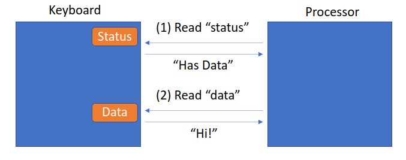
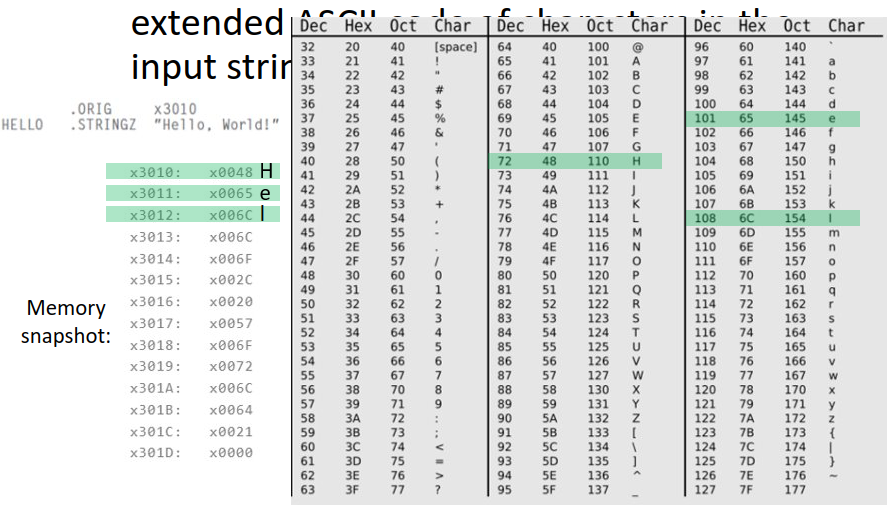

# Lec 11 IO
***Everything in a computer is controlled by instructions in the ISA*** \
## Question 1: Does ISA Nee need Special instructions for controlling IO 
* 2 registers used
    * Data register: Hold the data being transferred
    * Status register: Status of the device (busy, sleep, needs attention)
* 3 types of instructions (IO sometimes needs its own)
    * Operate 
    * Data movement 
    * Control Flow
* ISA needs special instructions and controls literally everything
* Special IO instruction
    * instrX <Operands>
    * Identify
        * Which device, operation, operands
    * 1965 DEC PDP-8 Computer
* Data movement instructions are also used to interact with IO
  * LOAD from IO register to input
  * STORE to IO register to output
* LC-3 Uses memory mapped IO 
  * Stored in Device Register Addresses
  * Each spot in memory is doing a different thing

* CPU communicates with IO device via 
    * Data register: The ascii code of the keystroke
    * Status register: tell whether keystroke happened

## Question 2: Does IO device need to work at the same speed as the processing unit?
IO device is slower than processor
Option 1: Processor that reduces frequency of talking to IO device (EX: accept at every 200m cycles)

### Synchronous vs Asynchronous IO
* Synchronous
    * Fixes speed IO device
    * Reads in fixed intervals (reads every ms or ever 5 ms)
    * Used for RAM and CPU (DDR5)
* Asynchronous
    * Used when Speed varies
    * Hand shake protocol
    * Read status then read data or write to data
    * 

**Polling vs Interrupt Driven**
Polling: Processor checks the status register periodically
Interrupt: Notification from IO Dev
     

## Question 3: Is IO transfer Initiated by a program or IO Device
 **Polling**: Processor checks status register \
 **Interrupt**: Notification from device