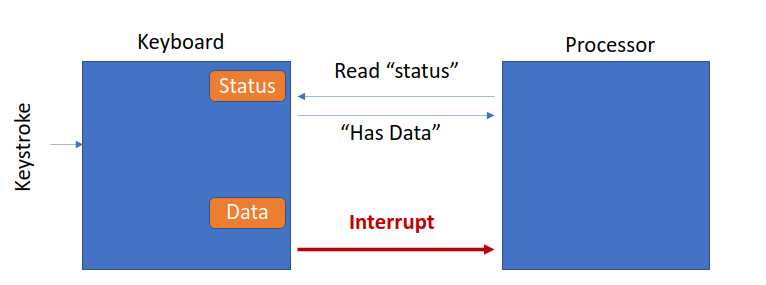

Everything in a computer is controlled by instructions in the ISA
3 types of instructions (IO sometimes needs its own)
    Operate 
    Data movement 
    Control Flow
Special IO instruction
    instrX <Operands>
    Identify
        Which device, operation, operands
    1965 DEC PDP-8 Computer

CPU communicates with IO device via 
    Data register: The ascii code of the keystroke
    Status register: tell whether keystroke happened

Memory Mapped IO
    LDI/LD/LDR Device register
        Input instruction
    ST/ST/STR Device register
        output instruction 

IO device is slower than processor
Option 1: Processor that reduces frequency of talking to IO device (EX: accept at every 200m cycles)

**Synchronous vs Asynchronous IO**
Synchronous
    Fixes speed IO device
    Reads in fixed intervals (reads every ms or ever 5 ms)
    Used for RAM and CPU (DDR5)
Asynchronous
    Hand shake protocol
    Read status then read data or write to data
    

**Polling vs Interrupt Driven**
Polling: Processor checks the status register periodically
Interrupt: Notification from IO Dev
     
    