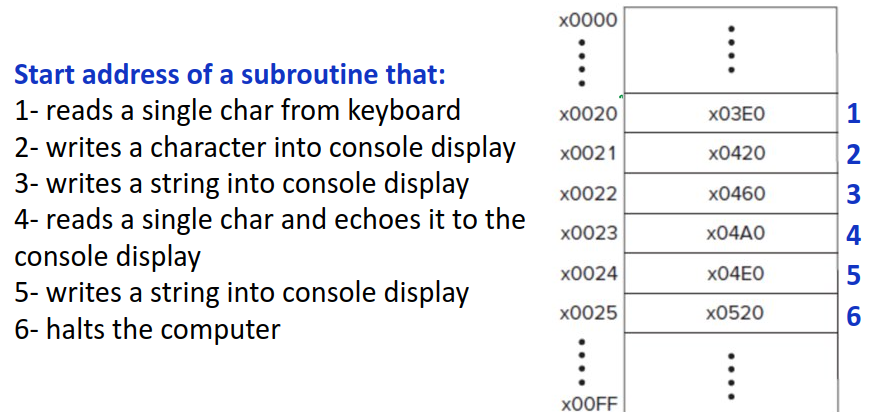

# Lec 12 and 11

Programmers need to know about low level but shouldnt access because they might mess something up
If device registers are shared it might lead to security issues

Driver is the code that allows access to IO devices

TRAP: Request from OS running in privaleged mode
Executed with a trap vector

TRAP Mechanism
    Service Routine         Function that executes on the behalf of the user by the OS (placed in system 
                            address space)
    TRAP Vector Table       Table of addresses for each routine (Address to get char is 0x5033 but that address is located 0001)
    TRAP Instruction
        1. Push PSR and PC to the system stack (Saves the current state before starting TRAP)
        2. Set Privilege in PSR to 0 (Gives full access)
        3. Set PC = mem[ZEXT(trap vector)] Trap vector is sign extended and points to an address and the PC is set to this address. The next instruction is the service at this address
        4. Execute service routine Now executes the routine     
    A Linkage (returning from TRAP instruction)
        Pop 2 values from call stack (PSR and PC)
        Set PSR bit 15 to 1 (Set privilege to user mode)

Polling
    CPU periodically checks IO device
    Waste CPU cycles but fast
Interrupt
    IO device notifies CPU
    Save CPU cycles but slow

Hybrid mode that switches

Interrupt
    Like a notification for CPU
    Hardware interrupts (timer, disk, keyboard)
    Software interrupts (interprocess communication)
    Exceptions (divide by 0, seg fault, stack overflow)

