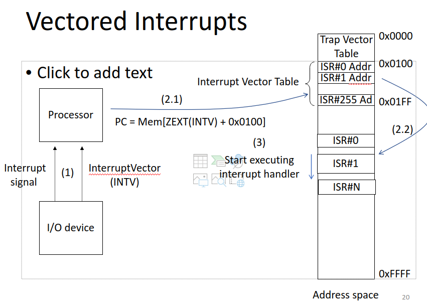
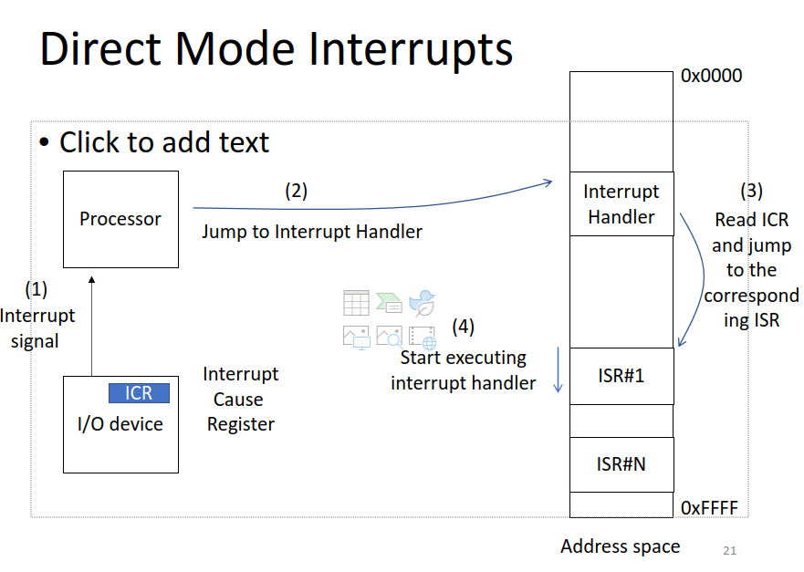

# Lec 13 Interrupt

## Interrupt vs TRAP
Interrupt is notification for processor

Interrupt causes CPU to run unexpected code
    Showing a warning
Trap requests service from OS to run expected code

## Causing the interrupt 
### Conditions for having an Interrupt 
1. I/O requires attention
2. I/O device has right to request a service
3. Servicing the IO device is more important than current operation

### IO device needs to be serviced
* A bit (the MSB) is set to 1 when the device is ready
* The second bit is an enable bit which the user can enable/disable depending on whether the user wants input
* The 2 bits are anded and the interrupt is processed if the output of and is 1
### Urgency of Interrupt
* Each program runs at a specific priority level
* For the interrupt to go through, the priority level should be higher than the current priority
    * There is combination logic to determine priority level
    

Interrupts can happen at any time of the Instruction processing phase but handled in the instruction boundry

## Handling Interrupt
3 steps:
1. Initiate interrupt
   1. Save the state of the current program in the supervisor stack to go back to
   2. Load the state of the interrupting program
2. Service Interrupt
   1. Do what the instructions say to do
3. return from interrupt
   1. Restore the state of the program by popping the PC and PSR from supervisor stack

### Vectored interrupt
- Interrupt vector provided by interrupting device
- Used by the processor to look at the interrupt vector table
- The table has the start addresses of memory locations with the start of an interrupt service routine
    - Interrupt service routines are fragments in memory that service interrupt events

### Direct Mode interrupt
- The Interrupt handler jumps straight to the corresponding ISR so it starts doing it right away

## Control and status registers
    Privilege registers for software/hardware communication 
    Have special instructions to read and write

    hart = HARdware Thread
        Interrupt related CSRs:
        - Mstatus: Hart current status
        - mtvec: Base address of interrupt vector
        - mie: enable/disable specific interrupts
        - mip: Which interrupts are pending
        - mcause: what caused the interrupts
