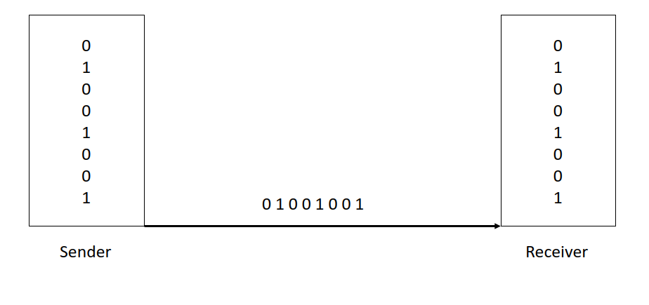
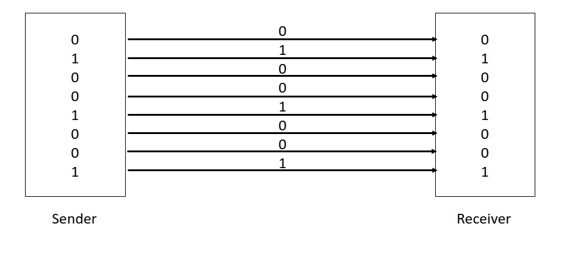

# Lec 14 IO Interfaces
## General purpose IO (GPIO)
    Programmable digital input/output
    Voltage to represent digital signals
        3.3V for 1
        0.0V for 0
    Useful to interact with devices

    Ohms Law: I * R = V
        V: voltage
        R: Resistor
        I: Current

## Serial vs Parallel interface
Serial uses a single line that sends a stream of info

Parallel uses multiple lines that all simultaneously send info

- Serial interfaces
    - Fewer pins and wires
    - More scalability
    - Lower power
    - low bandwidth (bad)
    - Ex
      - USB 
      - Sata
      - I2C
- Parallel interfaces
    - More pins and wires
    - Less scalability due to synchronizing lanes
    - Higher power consumption
    - more bandwidth (good)
    - Ex
      - PCIe
      - DDR
    
## Transfer types
Simplex:  1 to 1
Half duplex: 2 to 2 through one lane
Full duplex: 2 to 2 through 2 seperate lanes
