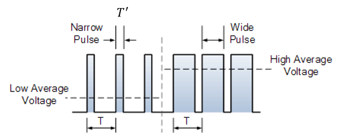
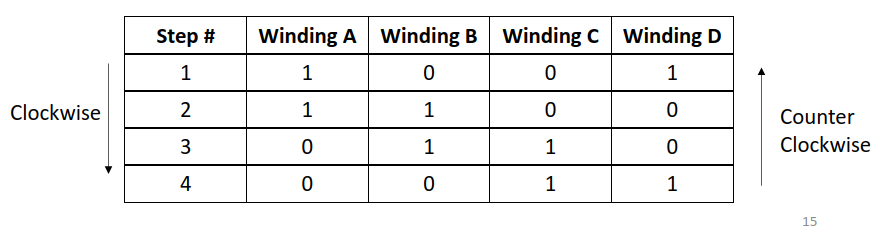

# Lec 16 Motors

## DC Motors
Magnetic fields to convert electrical energy to mechanical energy \
Speed controlled by voltage

### Brushed
- Current provided with two magnetic brushes that are north and south
- The stators (the stuff that moves) is opposite when attracting and same when pulling to move motor
- Windings wrapped around rotator teeth
- Cheaper, shorter lifespan
### Brushless
* Permanent magnetic rotor
* Windings around stator polls with microcontroller 
* More expensive, longer lifespan

## Control speed

### Pulse width modulation
- Speed of motor directly proportional to supply voltage
- Control power delivery by turning power on and off super fast
- Duty cycle (portion of on) Time on/Time off * 100%

In this case the T'/T is the Duty cycle

## DAC vs PWM
DAC used when sending information (Generating sound)
PWM used for controlling power or speed (LEDs for speed, moving motor)


## Servo motor
- Electrical device to control linear/angular position/velocity precisely
- Angle = f(PWM duty cycle)
    - ex: on for 1ms is 0 degree, on for 2 is 180
    - Like the one used in lab


## Stepper motor
- More accurate allowing fractional turns or n revolutions
- Low speed and torque
- Rotational angle proportional to input pulse
- Move in steps, no feedback needed
- Min step angle = (360/steps per rev)



## Make C code to generate bitstream on GPIO pins
```c
    #DEFINE A 3
    #DEFINE B 2
    #DEFINE C 1
    #DEFINE D 0
    vector_gen_func() {
        uint8_t val = *(volatile uint32_t * ) (GPIO_MMO); 
        //Assuming 8 bits of GPIO instead of 32, usually it is 32 and you you would need 28 ones instead of 4
        val = (0b1111 1001) & val //1001 because B and C off
        val = (0b0000 1001) | val //Can also write in hex, need to do twice to first turn B and C off and
                                    then to turn A and D on 
        val = *(volatile uint32_t * ) (GPIO_MMO); 
        val = (0b1111 1100) & val //AB
        val = (0b0000 1100) | val //AB
        //Repeat for all 4 steps 
    }
```