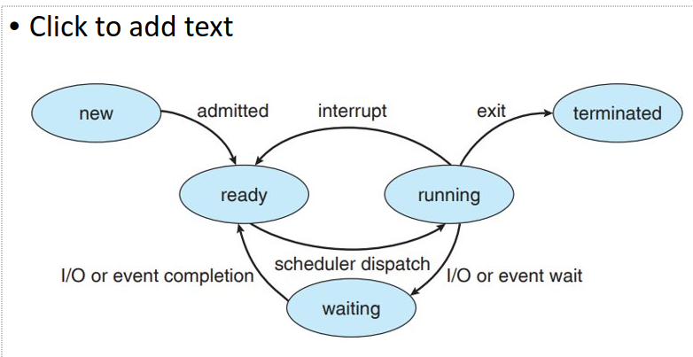

Baremetal vs Operating System

HiFive does not have OS
Rasp Pi does have OS

**Operating system does:**
    - Process management
    - Memory management
    - Storage management
    - Device management
    - Protection and security
    - Manages all the hardware (RAM, Hard drive, GPU)
    - Translates address so CPU can work with RAM (I think?)
    - Allows CPU to work with stuff other than RAM (maybe? Idk)
    - 
OS Assisted Execution: allows programs to access drivers
Baremetal execution: Can only use hardware libraries before reaching hard drive

**Real time OS**
Faster, lightweight, used in embedded systems
Specialized so that they guarantee fast, real-time response to current events
    Scheduling is key

When Program asks for memory from RAM that doesn't exist, the OS loads the information from the hard drive

*Process scheduling*
Sharing CPU time with multiple processes
Program asks OS to create a thread and then the OS creates it

*Process states*

New: Nothing happening gets admitted to ready
Ready: scheduler dispatch, then the scheduler dispatches to a running state
Running: The program is running. From there it is either interrupted, there is an IO event/wait or it exits
         If there is an interrupt it goes back to ready state
         If there is an I/O event or wait it goes in wait state
         Goes to terminated state if it needs to exit
Waiting: It waits until the event completion then goes back to ready

Maximum time that a process can use a CPU

*Process control block*
To support multiple active processes there needs to be a data structure (LC-3 had only one)

Context switches:
Current process running out and another process in
    Look at the current state of the processor
    Save the current context (condition codes, PC, all that)
    Take the context out and save it in the memory
    Take new context and switch into the processor so it can do a new program
    Do the new program and then save it back to memory and load the previous context
    
It is semi-real time

**real time systems**
Correctness of system depends on result and time of the results
2 requirements:
    Logical correctness: correct outputs
    Temporal correctness: output right time 

*Soft vs hard real-time*
Soft real time
    Missing deadline bad but not catestrophic
    quality of service
    playing music
Hard real time
    Missing deadlines is not an option
    nuclear plants
Gradient, not just one or the other

**Terms**
Job: 
    a unit of computation
    Ex: Servicing ONE interrupt from a keyboard (each keystroke is a job)
Task:
    Sequence of same jobs
    One task can have many jobs
    Ex: Get sentence that was typed out

Periodic Tasks:
    Time-triggered computation
    Task activated every T time units
    Each instance of task is a job
    Each job has the same relative deadline (period)
    Ex: most digital controllers 