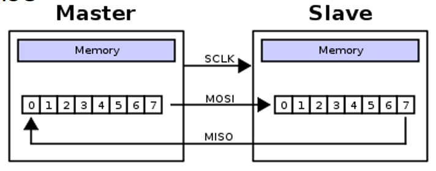

# Lec 14 IO Interfaces
## Synchronous vs Asych
* Synch:
    * Common shared clock
    * High throughput
    * Low scalibility

* Asynch: 
    * No shared clock
    * Asynch start/stop
    * Self-clocked, based on agreement between transmitter and receiver 

## Serial communication standard RS-232
* Asynch because no clock signal

* Introduced in 1962 to connect teletypes to modems 
* Electrical signals and teletypes standard
* 1 represented by -3 to -15V
* 0 represented by +3 to +15V

Essentially, it is a stream of bits starting from a start bit all the way to 2 end bits with an optional parity bit (also not sending anything is just 1s)
* Ex:
    * 0 101110100 1 11
    * The first bit is a start bit 
    * The 101110100 is the data
    * 1 is the parity bit (used to check for data correction by checking if the number of ones is odd or even, 1 if odd 0 if even so amount of bits should always be even)
    * 11 is the stop bit
* The data is scrambled (the first bit might be the LSB) so flip it

* goodput is used bits in data /12
* 12 bits is transferred in one frame 

## UART (uses RX 232)
* Convert parallel content of 8-bit register to a bit sequence ready to be transferred over a serial port
    * Baudrate is the speed at which information is being sent (can be anything)
* Both sender and receiver have to have agreed upon transmission
* Check if TX FIFO is not full, if it isn't full, send a byte
* 4 bits of overhead when sending info 
* So to send 8 bits you will actually send 12
## Types of Network
* Point to point: 1:1 communication
    * Faster when direct
    * More scalable
* Bus: shared, needs arbitration
    * More effeceint but slower
    * Master: Starts transfer
    * Slave: Cooperates with master

## I2C
 \
* Inter-integrated Circuit protocol 
* 2 Wires used
    * SDA for data
    * SCL for clock
* Standard speed is 100Kbps
* Ultra fast speed is 5MBps (50x faster)
* Serial synchronous bus
* 7 or 10 bits for slave address: 128 ~ 1024 devices 
* Bus interconnect

Start condition: When SCL is high, SDA high to low \
Stop condition: When SCL is high, SDA low to high \
Address frame is for the slave to know whether it recieves or not

* The master controls the bus because the slave cant write without the master's permission
* ACK/NACK
    * If read the master sets the ack/nack but if writing the slave sets the ack nack
    * Whoever is getting the info sets the ack nack
    * The first ack/nack is set by the slave because the slave has to receive the read/write instruction
* 8 bit granularity
* Every data frame is 8 bit but you can send as many as you want (along with ACK/NACK bit) until the master says no more

## **SPI** Serial periphrial Interface
Synchronous serial communication protocol \
4 lines full duplex, over 10 Mbps \
1 master but many slaves \
No start stop bit \
Fast short distance communication

 \
SCLK is the serial clock which the master sets to control communication \
SS is the slave select which selects which slave to use 

Master shifts out to MOSI (Master out slave in) for writing \
Slave shifts in from MISO (Master in slave out) for reading \
Slave shifts in from MOSI and out to MISO so it can transmit and recieve at the same time

## **USB**
Point to point serial communication \
One host multiple devices, can form a tree \
Two wires for single differential signal

No changes in signal means 1, 0 when there is a change in signal it is 0 \
This is done so that USB can handle noise due to electromagnetic interference allowing for longer communication.

