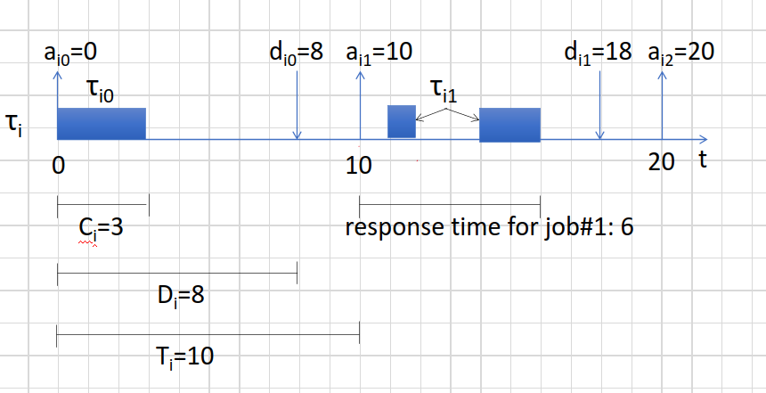
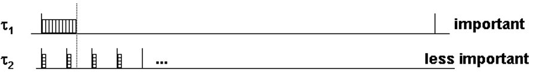

# Lec 17/18

**Periodic Tasks** 
Time triggered computation
Activated periodically every T time units
Each instance of task is called a job and each job has the same relative deadline

Task denoted by Taoi
    Each task has execution time (Ci)
        Job not always ready to be activated once it arrives, sometimes needs time
    Relative deadline: Di, Job needs to be completed before the deadline
        related to release time
    Period: Ti

Each job Taoij of Taoi (first job is Taoi0)
    Activation Time is the activation time of the previous job + period
        The instant when the job is ready to execute
    Each job has a different absolute deadline: dij = activation time + Di 
        Specified in absolute time (train and plane schedules)

Absolute deadline: d 
Relative deadline: D
Relative time is longer than process time so that if there are multiple tasks, they can still meet the deadline

In this case, Ci is the execution time, Di and di is the relative and absolute deadline, Ti is the total period

**Aperiodic Task**
Event Triggered computation
Task activated by external event 
Relative Deadline is the time to respond to event 
Minimal inter-arrival time is assumed to be known so that deadline can be met
    Time between the arrival of 2 events

**Real time scheduling**
Scheduling 
    Pick the task to run next
Priority based
    Pick the highest priority among tasks that are ready

**priority and Criticality** 
Priority: Order executing job 
Criticality (importance): Penalty if task missed a deadline 

If priorities are assigned according to importance then it is possible to miss deadlines 

If period of t2 is less than the execution time of task 1. t2 will miss the deadline
Do task 2 and while waiting for next task 2, do dask 1

**Utilization** 
A task's CPU utilization is the fraction of time that it is using the cpu
Utilization is execution time/ period U= C/p
If you have a set of of periodic tasks the utilization is the sum of the periodic tasks 
The limit of U would be 1 since you can't use more than 1 CPU 

**Scheduling algorithims**
Fixed Static priority scheduling
    All jobs have same priority
    Assign priority based on deadline
    Shorter period = higher priority
    Rate Monotonic

Dynamic Period scheduling:
    Different jobs of same task can have different priority
    earliest deadline first

