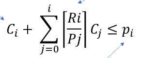

# Lec 19
When breaking ties for EDF you need to decide the priority (ex shorter period) \
RM is preferred because the less priority is always the one most likely to not be completed

## Liu and Layland Bound

* It is schedulable if the total processing time is less than the UB
* n is the amount of tasks
    * UB = n(2^(1/n) -1 )
    * UB(1) = 1
    * UB(2) = .828
    * UB(3) = .779
    * When n is inf UB = ln(2) = .694
* If the utilization is < the UB then it is schedulable with RM
* If the utilization is > the UB then it may or may not be schedulable and we need to do more tests
* Example:
    * so if there are 3 tasks:
    * 3 / 10
    * 6 / 15
    * 10 / 35
    * The sum of this is 98.5%
    * This is greater than UB(3) which means that RM may or may not work
* When using RM, higher priority tasks are always ran earlier than lower priority tasks

## Exact schedulability test
    Ri: Response time, time it takes from activation to completion
    Interference:
        (uses cieling function)
        [Ri/Pj] * Cj
    Total interference caused by higher priority task j to lower priority task i
    Ri: response time for lower priority task
    Pj: Period of higher priority task
    Cj: Compute time of higher priority task

    Ex: Task 1 compute time = 4 and period 10, Task 2 compute time 13 and period of 25
    Response time for task 2 is 25 (Ri)
    Period of higher priority task is 10 (Pj)
    Compute time of higher priority task is 4 (Cj)

    Total interference: [25/10] * 4 = 3 * 4 = 12

    Interference + Compute time  <= period