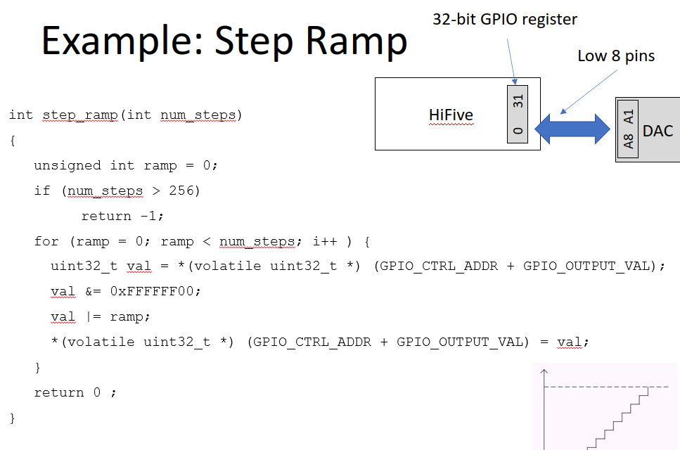

# Lec 15 ADC DAC
>*__LOW IS ONE__*
## Digital to Analog Conversion
8 bit input, V(A1/2 + A2/4... A8/256) \
Where the An is 1 if the input is 1 \
GPIO 0 is ALWAYS LSB

## Step ramp

Its a function that goes up by integers (truncation) 

HiFive has a 32 bit register but we only want to change the last 8 bits (LSB) \
So we get current value of the register and AND it with FFFF00 so it resets the last 8 digits to be changed \
Then it is ORed with the ramp (ramp can only be a max of 256 because thats how many bits there are) and the register is set to the new value 

This is done n times with ramp increasing so that the voltage slowly increases 
(io devices slide 12)

This also assumes the DAC is for bit 0-7. If it is 8-15, do FFFF00FF for the anding if it is 8-16 (exclusive)

If voltage input is less, the Voltage Reference gets lower too and so does the step size (mV)

**NEED TO KNOW BIT MANIP**

## ADC (Analog to digital converter)

### Timing
    CS = Active low signal
    When it is low, device is ready to start accepting communication
    WR = Write
    Start conversation (high to low)
    D0-D7 The data lines where data comes from
    INTR = Interrupt
    High to Low says communication completed and ready to read data
    RD = Read
    Telling to read the data (high to low is reading data)
