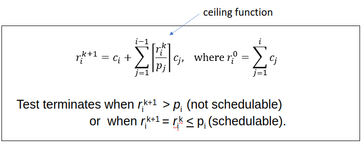
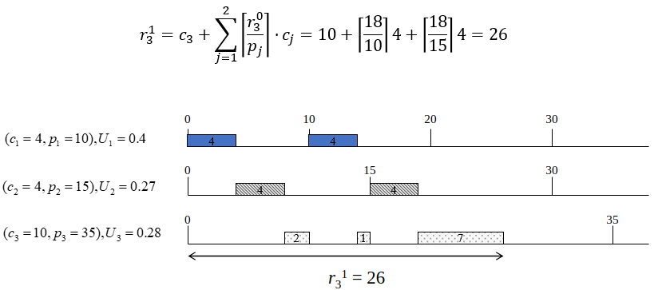
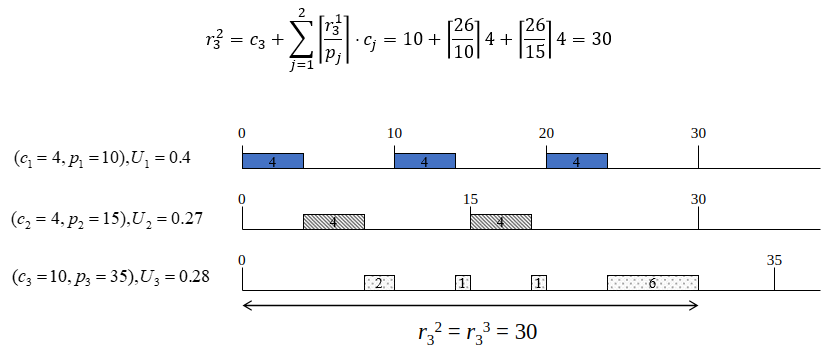
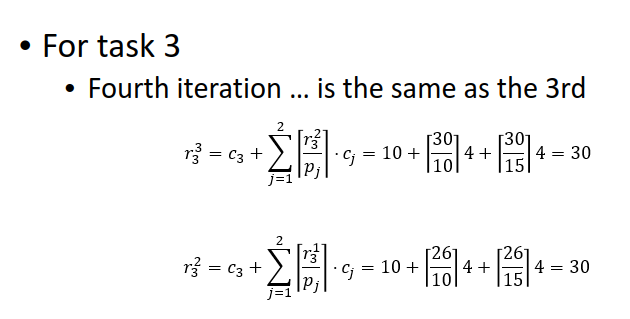

# Lec 19 Schedulability

## Exact Schedulability Test

Ri (response time) / 

## Critical Instant Theorem

If a task meets its first deadline when all higher priority tasks are started at the same time, then this tasks future deadlines will always be met
 \
Ri is response time \
Ci is the execute time for the final task \
Pj is the period of the more important tasks \
Cj is the compute time of the higher priority tasks

 \
First iteration you just add up the periods to see if there is any overlap

 \
Step 2 you do c3 + the sum of the interference of the 2 higher priority tasks, in this case \
The r30 was 18 so 18/10(period of first task)* 4 + 18/15 (period of second task) * 4 + 10 =26

 \
For The third task, add the execution time for task 3 + interference of task 1 (response time of step 2/ period of 1 * execution time of 1) + interference of 2 (response time of step 2/ period of 2 * execution time of 2)=30 \

 \
If the next iteration is the same as the previous then you are done

**NOT SCHEDULABLE** when response time is more than the period \
**SCHEDULABLE** when response time is the same as the response time for the previous iteration and it is less than the period