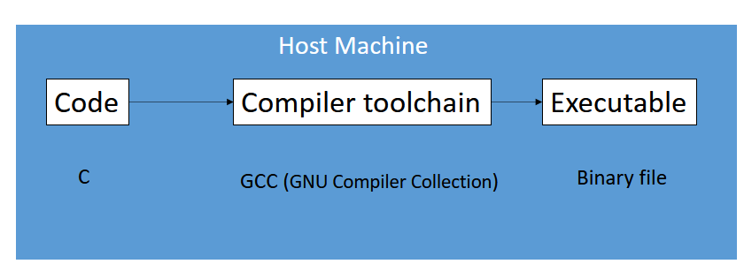

# Lec 2
Operating system isn't needed but makes life a whole lot easier

## Instruction Set Architecture (ISA)

ISA is the vocab of computers \
Defines interface to processor \
Decouples usage and implementation \
    Ex: ARM, x86, RISC \
Software layers in ARM allow for backwards compatibility

There is a debugger between embedded system and host machine \
The host machine usually has build enviornment because target has less resources

## Compiler Toolchain

The code that you write --> <preprocessor> --> macro (replaced all #DEFINE and stuff) --> <compiler (gcc)> --> Assembly Code --> <Assembler> --> Machine code --> <linker> --> .exe file
C becomes binary

Native compilation: Compile and run on same system

Cross compilation: Compile on one system and run on another system

## Make file
Controls the generation of executables, triggers preprocessing/compiling/assembling/linking in order to make an executable \
Widely used standard which is neccesary for keeping things the same 

## IDE
Autogenerate Makefiles \
Simple interface for developers \
Profs have own make files because bad for sustainability and collaboration (we don't know the make file) \

## Version control system
Software that allows tracking changes (like Git) \
Allow better collaboration

# Lec 3
## C
Embedded systems mostly use C because allows memory management, optimizations, etc while still being effecient to code in
