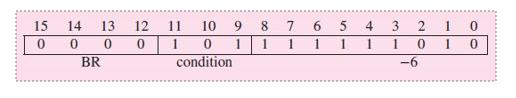

**OPCODE LD (Load) 0010**
Go to a memory address, read it and store it to a specified register so that it can be used for instructions
Address (or destination register) = PC (Program Counter) + sign extended bits [8:0] to 16 bits
*relative addressing*
addressing in relation to the PC (+- 256)
Only works close to PC
**Read the instruction**
1. Read instruction from memory into the register (FETCH)
2. DECODE the instruction
3. Evaluate address (optional)
4. FETCH OPERANDS from register file or memory
5. EXECUTE OPERANDS in ALU
6. STORE RESULTS into register file or memory

*FETCH*
Obtain next instruction from memory into IR
PC points to the "next instruction" in the memory
1. LOAD Memory address register with PC and then increment PC (so PC points at next instruction)
2. Instruction loaded from memroy to Memory Data Register
3. Copy MDR to IR
NOTE: Each step is one machine cycle (4GHz is 4 billion clock cycles per s)

*Decode*
First Determine instruction type 
4 bits
Ex 0010 for load

*Evaluate Address*
Only for memroy address instructions like LOAD
For LD, extends bits and adds to PC

*FETCH OPERANDS*
Get source operands to process instruction
Ex: ADD, read from reg file
Ex: LD, Load address to MAR then interrogate memory

*EXECUTE*
Does the instruction

*STORE RESULTS*
Result written to destination
For add, updates reg file

**Changing seq of execution**
Control instuction: Change seq of instruction execution like branches
**Conditional branch instruction in LC3** 0000 opcode
*condition 101*: Take branch if prev instruction result is not 0
^^^^^ First digit is negative, second is zero, and third is positive 
So 001 would be take branch if prev instruction result is positive
First 4 digits are for the BR instruction, next 3 are for condition, last 9 are for number -6

