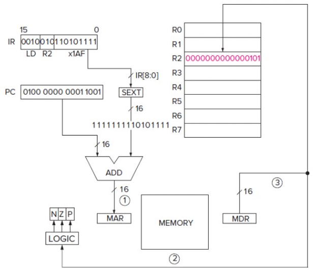
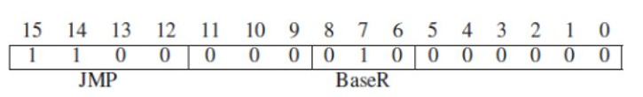

# Lec 5 LC-3
## Instruction Set Register
* Memory organization
  * 16 bit addressability (2 bytes) 
  * 2^16 address space 
* General purpose register 
  * 8 of them and 16 bits each 
  * Accessed in 1 clock cycle
  * Does math and stores info
* Availible Instruction
    * Defined by OPcode, data type, and addressing mode
    * 15 opcodes, 1 reserved in LC3, 19 total instructions (some share)
    * 2s complement
    * *5 modes*
        * Immediate
        * Register
        * PC Relative (memory)
        * Indirect (memory)
        * Base + offset

## Condition Codes
* NZP: NEgative, Zero, positive
* Each time operate or load is e the codes are set
* Dependant on the result of the last instruction 

## Operations 
Only add, and, and not \
To Subtract you need to NOT the second number, add 1, then add it to the first \
### Immediates
Dont get value from register, they use the given value \
R3 = R2 + 5 \
Bit 5 declares immediate or not
### Subt
To do R3 = R2 - R1
    Not R2 to get 2s complement
    Add 1 to R2 so that R2 is now negative original number
    Do R3 = R2 + R1 
### Load effective address
Load Destination Register with PC (Program counter or current instruction) + SEXT(8 bits)

## Data Movement Instruction
Moves data between reigster, memory, and IO devices \
Load: Memory to register \
Store: Register to memory \
OPcode, source, and destination needed \

2 Operands: 
* 1 source: data to be moved 
* 1 destination: WHere the data is moved to \
One operand is a register and the other is a memory location or IO device
### PC Relative mode
LD and ST
Address = PC + SEXT(bits[0-8])
Limited range ([255-256]) of PC

### Indirect Mode
LDI and STI \
Address = Mem{PC+Mem[SEXT(bits[0-8])]} \
Address not limited because Memory at sext can be anything 

Add Offset to PC then go to that address. Go to the address at that address and get the value from there  \
### Base + Offset
LDR and STR \
Address = SEXT(bits[0-5]) + Reg# 

Add 6 bits to whatever register to get the value 
## Control
Alter sequence of instructions \
5 types
* Conditional Branch
* Unconditional Jump 
* Subroutine (function) call 
* TRAP (service call)
* RTI (Return from trap or interrupt or function)

### Conditional Branch (BR)
OPcode 0000 \
Tells whether to execute next instruction in sequence or out of sequence \
This decision is based off the results of the previous instruction \
Control codes are n, z, p, at bits 11-9 respectively 
 \
If last instruction is 0, jump x0D9 spaces 
### Unconditional Branch (Jump)
Unconditional jump \
Execute next instruction from Mem[Register base] \
So if R2 = 00FA the next instruction is from 0x00FA

## Trap instruction
Invokes OS call \
Bits[0-7] (trap vector) identify which service call \
Once done, PC looks at the next instruction \
    Ex: Read char from keyboard, write char to screen