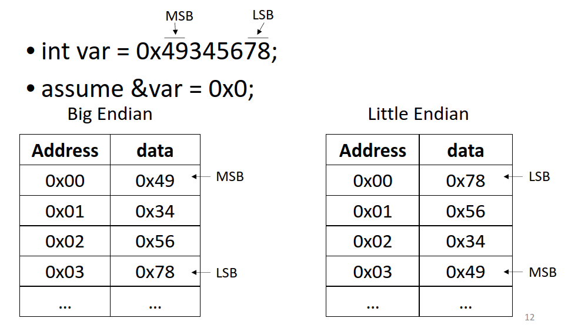

# Lec 3
## << and >> bitwise operators
For unsigned ints and chars, add 0 to left or right \
For signed: \   
*   If it is a positive number or << , treat it the same    
*   If it is a negative number and >> , add the significant digit (1) to the end

# Lec 4
## Von Neumann computer model
    Input: Keyboard, mouse, etc. Gets input from CU
    Memory: Gets from input and CU

### Memory:
    - Contains bits that stores instructions and Data
    - Each location has address (memory location) and content (bits stored at ____ memory address)
        - Address space: The amount of memory you can save (2^n)
        - Addressibility: # of bits stored at each address (usually 8 bits/1 byte)
    - Content: bits stored at each address
    - Accessed through Memory Address Register and Memory Data Register
        - If write:
            CPU loads address of memory it wants to write to in MAR
            CPU loads data it wants to write into MDR 
            Data from MDR is written to the memory location stored in the MAR
        - If read:
            CPU loads address of memory it wants to load into MAR
            The memory accesses the data at the address in the MAR
            Data accessed is transferred to MDR
            CPU reads the data from the MDR
            
            Essentially: Memory reads MAR's content to MDR (MAR is a pointer) then CPU reads the MDR
## Little vs Big Endian
                                Ex: 987654321
    - Most significant byte (MSB) is the largest number, in this case 9
    - Least significant byte (LSB) is the smallest number, in this case 1
    - Little Endian is the LSB is at the lowest address (0) and MSB is at the highest address
    - Big Endian is the MSB is at the lowest address (0) and the LSB is at the highest address
    - It doesn't really matter you just have to know which one your pc is.

## Processing Unit aka CPU
Word Length: Length of instruction (16 for LC-3 and 64 for x84) \
Arithmetic and Logic Unit (ALU)
- Math and logic functions
- Word length, 64 or 32 bit
Registers
- Small temp storage close to ALU
- Results of ALU
- Prevent long latency accesses to memory
- Fast but small
- Register file: Structure in CPU with all registers for reading and writing not storing
  - One file has all the registers
  - Special Registers: Specific roles not for data computation Ex: Stack pointer MAR and MDR
  - General Registers:General purpose for operations

## Peripherials
- Input and output devices to get data in and out of computer
- Each device has its own registers

## Control Unit
- Program Counter (PC) and Instruction Register (IR)
- IR: Current instruction being executed on the CPU
- PC: Address of next instruction