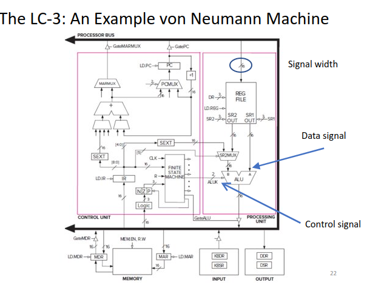
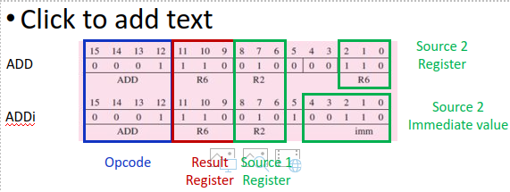

# Lec 4 (Von Nuemann)
## Control unit
Reads address from memory from address stored in PC \
Stores into IR \
Decodes it and the sends signals to other component \
Tell other components what do to \

## Multiplexer
Takes in multiple inputs and has one output

## instruction
    Smallest Unit of execution Instructions are sequence of bits with 2 pieces of information
        Opcode: operation (+, !, >=)
        Operands: data to be used
    LC-3 has 15 instructions
        opcode: 4 bits needed
        operands: 12 bits left
        Also 6 data movement instructions
    Add instruction
        3 operands: 2 numbers that will be added and 1 destination (sum)
        >= 1 operands are from register and result stored in register
        Ex: ADD R3, R1, R2 is R3 = R1 + R2
        2 source registers are used to get information and then a destination register is used to store the result
        If bit number 5 is 0 then ADD elif 1 then ADDi (Add but 1 var and 1 immediate value)

